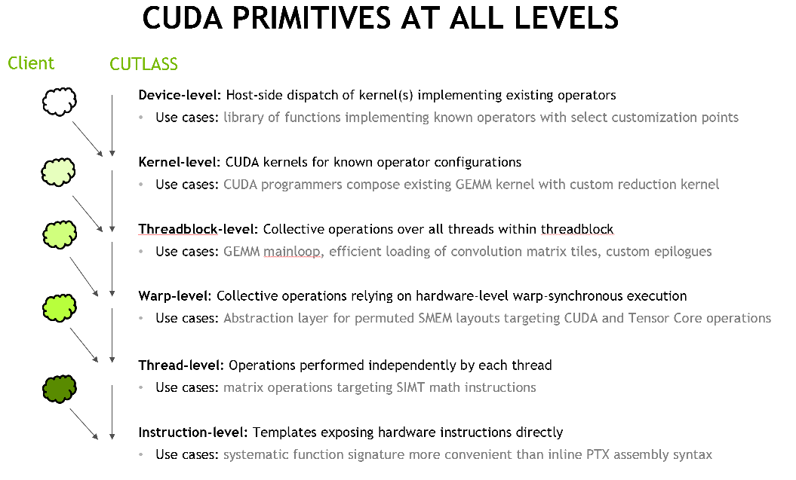

## 第 1 章:Overview——examples/48 + 5 层架构图 + `*Type` 开关预览

本章是教程的入口。**一篇文章三件事**,目标:读完脑子里有"5 层骨架 + 一份能跑通的代码 + 4 个能改的开关"。后续章节才分别展开每一层。

### 1.0 本章要做的事

```text
§1.1  examples/48 走读          ← 看一份能跑的代码
§1.2  5 层架构图                 ← 看代码底下是什么
§1.3  examples/49:4 个 *Type 开关 ← 看 5 层是怎么被"配置空间"驱动的
```

读到 §1.3 末尾你会想:"那 5 层各自的内部细节呢?"—— 那就从 Ch2 开始。

---

### 1.1 examples/48 走读:用 CUTLASS 跑一个 TF32 Hopper GEMM

文件:`examples/48_hopper_warp_specialized_gemm/48_hopper_warp_specialized_gemm.cu`。

CUTLASS 跑一个 GEMM 的 5 步——看完就懂 §1.2 的"Adapter 层"在做什么:

```cpp
// 1. Gemm 实例化(模板实例化:把类型 + 形状烧进 kernel)
Gemm gemm;

// 2. 组装 6 元组 Arguments(problem_shape, A/B/C/D 指针 + stride, ...)
auto arguments = args_from_options(options);

// 3. 算 workspace(给 reduction / group scheduler 等用的 gmem)
size_t ws = Gemm::get_workspace_size(arguments);
Gemm::device_memory::allocation<uint8_t> workspace(ws);

// 4. 校验 + 初始化(编译期能查的都查;运行期只做最少的事)
CUTLASS_CHECK(gemm.can_implement(arguments));
CUTLASS_CHECK(gemm.initialize(arguments, workspace.get()));

// 5. Launch
CUTLASS_CHECK(gemm.run());
```

这 5 步封装了原本你手写的 `cudaLaunchKernel(...)` + 一堆 setup call——CUTLASS 把每一步都暴露出来,所以你可以查、可以插桩、可以替换。

#### `using` 别名——这才是"模板参数填空"的真貌

```cpp
using ElementA = float;            // TF32(等同 float,tensor core 截断)
using ElementB = float;
using ElementAccumulator = float;
using ElementC = float;
using ElementD = float;

using LayoutA = cutlass::layout::RowMajor;
using LayoutB = cutlass::layout::ColumnMajor;
using LayoutC = cutlass::layout::RowMajor;
using LayoutD = cutlass::layout::RowMajor;

using TileShape      = Shape<_128, _128, _32>;   // BlockM × BlockN × BlockK
using ClusterShape   = Shape<_2, _1, _1>;        // 2 CTA 沿 M 协作
```

前 12 个类型别名就是描述"我要算什么"——类型、layout、tile、cluster。

#### CollectiveBuilder——把上面 12 个塞进去,产出 CollectiveMainloop + CollectiveEpilogue

```cpp
using CollectiveMainloop = typename cutlass::gemm::collective::CollectiveBuilder<
    cutlass::arch::Sm90, cutlass::arch::OpClassTensorOp,
    ElementA, LayoutA, AlignmentA,                       // A 边 3 元
    ElementB, LayoutB, AlignmentB,                       // B 边 3 元
    ElementAccumulator,
    TileShape, ClusterShape,
    cutlass::gemm::collective::StageCountAuto,           // stages: auto
    cutlass::gemm::collective::KernelScheduleAuto         // schedule: auto
>::CollectiveOp;
```

Builder 把这 13 个模板参数**编译期**路由到对应的 partial specialization,**产出**一个具体的 `CollectiveMainloop` 实例(就是 §1.2 里的"第 3 层")。`StageCountAuto` / `KernelScheduleAuto` 是占位符——Builder 内部按 dtype + tile size 启发式选具体的 pipeline depth 和 dispatch policy。

Epilogue 的 builder 同构,产出 `CollectiveEpilogue`。

#### 拼装 kernel + adapter

```cpp
using GemmKernel = cutlass::gemm::kernel::GemmUniversal<
    Shape<int, int, int>,         // problem shape 动态
    CollectiveMainloop,
    CollectiveEpilogue
>;
using Gemm = cutlass::gemm::device::GemmUniversalAdapter<GemmKernel>;
```

`GemmUniversalAdapter<GemmKernel>` 是 host 句柄——就是你 `gemm.run()` 调用的那个对象。`GemmKernel` 才是 device kernel 体。

#### Adapter 三段式:can_implement / initialize / run

- `can_implement(args)`:校验类型/对齐/layout 是否合法。**几乎所有不合法都在这里拒掉**——大部分错误会在编译期被 `static_assert` 拒掉,运行时校验是兜底。
- `initialize(args, workspace)`:把所有 host 端的指针 / stride 转成 device 端可用的 `Params`,固化到 `gemm.params_`。**只做一次,后续 run 复用**。
- `run()`:调 `cudaLaunchKernel(...)`。`Params` 已经固化,launch 是 trivial 的。

> **你手写 GEMM 的对照**:你写 kernel 时也是这 5 步——`cudaMalloc workspace` + `cudaMemcpy args` + `cudaLaunchKernel(...)`。CUTLASS 把这些都"暴露成对象方法",让你写 `gemm.initialize(...)` 而不是手撸一堆 cuda runtime call。

---

### 1.2 5 层架构图

上一节的代码看起来很多,但它**正好**对应 5 个 C++ 类,每类对应一件事:

```text
┌─ 你调用的 5 个 API
│
├─ 1. GemmUniversalAdapter  ──  host 句柄(§1.1 的 5 步)
├─ 2. GemmUniversal<...>     ──  device kernel 体(主循环 + scheduler 入口)
├─ 3. CollectiveMma          ──  加载 A/B → mma(事 3 + 事 4)
├─ 4. CollectiveEpilogue     ──  写回 C/D + 融合算子(事 5)
└─ 5. *TileScheduler         ──  切 tile + 排队(事 1 + 事 2)
```



#### 第 1 层:Adapter

文件:`include/cutlass/gemm/device/gemm_universal_adapter.h`。

**角色**:整个 GEMM 在 host 端的"开机关收尾"——`can_implement` / `initialize` / `run` 三段式。

Adapter 是一个薄 stateful handle——内部持有一个 kernel `Params params_`,没有任何 GEMM 知识,所有知识委托给内核。

> **你手写 GEMM 的对照**:你的 host launch——`cudaLaunchKernel(grid, block, args)`。Adapter 把这一行拆成"建句柄 → 校验 → 算 workspace → 绑参数 → launch"五步,每一步都暴露出来。

#### 第 2 层:Kernel orchestrator

文件:`include/cutlass/gemm/kernel/sm90_gemm_tma_warpspecialized.hpp`。

**角色**:kernel 体本身——CTA 之间谁跑哪个 tile、CTA 内 producer/consumer 各跑什么、pipeline 怎么推进、cluster barrier 怎么同步。

模板签名:

```cpp
template <
  class ProblemShape_,        // M, N, K
  class CollectiveMainloop_,  // 第 3 层
  class CollectiveEpilogue_,  // 第 4 层
  class TileScheduler_        // 第 5 层(默认 void)
>
class GemmUniversal { ... };  // 包含 CUTLASS_DEVICE operator()(Params, char* smem_buf)
```

`TileScheduler_` 默认 `void`,内部通过 `TileSchedulerSelector` 路由为 `PersistentTileSchedulerSm90`(SM90 Hopper 默认)。改写它(传 `StreamKScheduler` / `GroupScheduler`)就切调度器,**kernel 体代码不变**——这是 Ch6 / Ch7 的核心机制。

#### 第 3 层:CollectiveMainloop

主文件:`include/cutlass/gemm/collective/sm90_mma_tma_gmma_ss_warpspecialized.hpp`。

**角色**:把 A/B 从 gmem 拉入 smem、smem 入 register、用 WGMMA / UMMA 做 mma、再把结果放进 accumulator。这一层封装最繁——Ch3 展开。

调用接口标准签名(对任意架构、任意 mma 形态;成员对应 Ch3 的实际实现):

```cpp
struct CollectiveMma {
  MainloopParams to_underlying_arguments(...);
  static void prefetch_tma_descriptors(MainloopParams const&);
  static bool can_implement(...);

  void load_init(...);   // K-loop 起点
  void load(...);        // K-loop producer
  void mma(...);         // K-loop consumer
  void mma_tail(...);    // K-loop 末尾
  void load_tail(...);
};
```

这一层决定:加载用 TMA 还是 cp.async、A 从 smem 还是直接 rmem、单 vs 双 warp-group、FP8 block-scale 等。

#### 第 4 层:CollectiveEpilogue

主文件:`include/cutlass/epilogue/collective/sm90_epilogue_tma_warpspecialized.hpp`。

**角色**:`D = alpha * (A*B) + beta * C` 及更复杂的链——bias、ReLU、silu、top-K softmax。EVT(`include/cutlass/epilogue/fusion/`)是融合算子的"小 DSL"。

#### 第 5 层:TileScheduler

主文件:`include/cutlass/gemm/kernel/sm90_tile_scheduler.hpp`(默认 `PersistentTileSchedulerSm90`),变体:`sm90_tile_scheduler_stream_k.hpp`、`sm90_tile_scheduler_group.hpp`。

**角色**:把 `(M, N)` 切成若干 `(blockM, blockN)` tile,给每个 CTA 一个 work id 或一组 work id。

```cpp
struct PersistentTileSchedulerSm90 {
  cute::tuple<WorkTileInfo, bool> fetch_next_work(WorkTileInfo prev);
};
```

Scheduler 也有自己的参数(由 host 端 `Arguments.scheduler` 填):

```cpp
arguments.scheduler.raster_order     = options.raster;       // AlongN / AlongM / Heuristic
arguments.scheduler.max_swizzle_size = options.swizzle;      // 1 / 2 / 4 / 8
```

> **你手写 GEMM 的对照**:你的 `grid_dim` 计算 + `blockIdx` 分配策略。CUTLASS 默认走"persistent + swizzle + raster"——Ch6 详细。

---

### 1.3 `examples/49` 预览:4 个 `*Type` 开关

文件:`examples/49_hopper_gemm_with_collective_builder/49_collective_builder.cu`。

examples/48 跑通一个固定配置;examples/49 在编译期把"哪些层可以怎么换"暴露成 template 参数。`ExampleRunner<...>` 让你在编译期切 4 件事 + 1 个 bool:

```cpp
template <
  class MainloopScheduleType = cutlass::gemm::collective::KernelScheduleAuto,
  class EpilogueScheduleType = cutlass::epilogue::collective::EpilogueScheduleAuto,
  class StageCountType       = cutlass::gemm::collective::StageCountAuto,
  class TileSchedulerType    = cutlass::gemm::PersistentScheduler,
  bool UseCustomEVT          = false
>
struct ExampleRunner {
  using CollectiveMainloop = typename cutlass::gemm::collective::CollectiveBuilder<
      cutlass::arch::Sm90, cutlass::arch::OpClassTensorOp,
      ElementA, LayoutA, AlignmentA,
      ElementB, LayoutB, AlignmentB,
      ElementAccumulator,
      TileShape, ClusterShape,
      StageCountType,         // ← user
      MainloopScheduleType    // ← user
  >::CollectiveOp;

  using CollectiveEpilogue = typename cutlass::epilogue::collective::CollectiveBuilder<
      /* ... */,
      EpilogueScheduleType    // ← user
  >::CollectiveOp;

  using GemmKernel = cutlass::gemm::kernel::GemmUniversal<
      Shape<int, int, int>,
      CollectiveMainloop,
      CollectiveEpilogue,
      TileSchedulerType       // ← user
  >;

  using Gemm = cutlass::gemm::device::GemmUniversalAdapter<GemmKernel>;
};
```

#### 5 个开关各自做什么

| 开关 | 默认 | 作用 | 改后落到哪一层 |
|---|---|---|---|
| `MainloopScheduleType` | `KernelScheduleAuto` | mainloop pipeline 形态(单/双/多 consumer warp group)| 第 3 层 mainloop + Ch7 dispatch |
| `EpilogueScheduleType` | `EpilogueScheduleAuto` | epilogue StagesC / StagesD / FragmentSize / ReuseSmemC 等 | 第 4 层 epilogue |
| `StageCountType` | `StageCountAuto` | mainloop smem pipeline 深度 | 第 3 层 mainloop |
| `TileSchedulerType` | `PersistentScheduler` | persistent / StreamK / Grouped GEMM 调度 | 第 5 层 scheduler |
| `UseCustomEVT` | `false` | 是否在 epilogue 上加 bias+ReLU 之类的融合 | 第 4 层 epilogue |

每一个都是"换 1 行 type alias"的成本——CUTLASS 编译期 partial specialization 路由到具体实现,**没有运行时调度,没有运行时代价**。

#### 一次 launch 跑多次:扫"配置网格"

```cpp
int main() {
  // 默认 — 跟 examples/48 一样
  run<Default, Default, ..., false>();

  // 切到 Pingpong
  run<KernelTmaWarpSpecializedPingpong, Default, ..., false>();

  // 加 EVT bias + ReLU
  run<Default, Default, ..., true>();

  // 改 TileScheduler 为 StreamK
  run<Default, Default, ..., StreamKScheduler, false>();
}
```

`main()` 用一个 4 维配置网格跑多次——这是"模板参数填空"的最直观展示。每一行 type alias 编译出一份不同的 kernel,你看到的是"换 1 行 type,跑出不同的二进制"。

> **你手写 GEMM 的对照**:你写 template parameter 化的 GEMM 是用 `if constexpr` + 多个 `#ifdef` 分支;CUTLASS 用 partial specialization——编译器**完全**只编当前选定的那个 specialization,生成的代码无冗余,inline 优化更彻底。

#### 这一章的 takeaway

读到这里的你应该能:

- 看 `examples/48` 的代码认出 5 个 C++ 类的名字和位置。
- 看 `examples/49` 的 `ExampleRunner<...>` 认出 4 个 `*Type` 参数对应哪一层。
- 把"5 层 + 4 开关"装到脑子里,作为后续章节展开的锚点。

---

### 1.4 章末:读完这一章你该做得到的事

- ✅ 在 `examples/48` 的代码里认出 5 个 CUTLASS 类名(Adapter / GemmUniversal / CollectiveMma / CollectiveEpilogue / TileScheduler)。
- ✅ 看到 `CollectiveBuilder<...>` 知道它在用 partial specialization 路由到一个具体的 `CollectiveMma` 实例。
- ✅ 在 `examples/49` 的 `ExampleRunner<...>` 里认出 4 个 `*Type` 开关各对应哪一层。
- ✅ 知道 §1.1 是 Adapter 层细节的入口,§1.2 是 5 层骨架入口,§1.3 是"配置空间"入口。
- ✅ 不需要记住每个类的每个成员——Ch2 起逐层展开。

下一章 Ch2 看 CuTe——所有这些 C++ 抽象"描述数据布局"用的语言。

---