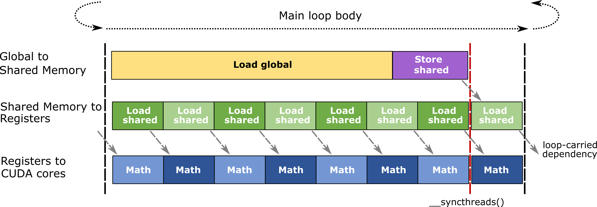
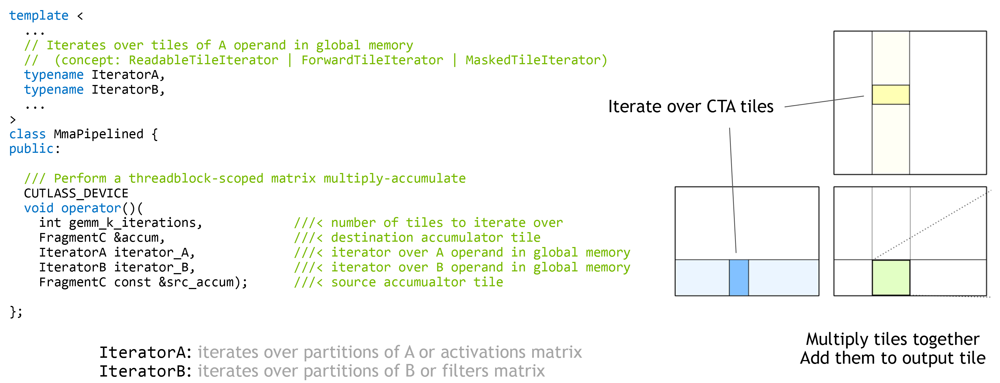

## 第 4 章:深入 CollectiveMainloop(本教程核心价值)

如果本教程只选一章细读,选这一章。Mainloop 是 CUTLASS 3.x 写得最繁的部分——也是体现"5 层抽象是否值钱"的地方。

主文件:`include/cutlass/gemm/collective/sm90_mma_tma_gmma_ss_warpspecialized.hpp`。

读法:**从类头部分支开始,顺着类型别名 → helper → 主循环的 6 个函数 → SharedStorage**走。

### 4.1 类头部分支(在文件前 1/3 段)

```cpp
namespace cutlass::gemm::collective {

template <
  class MainloopSm90TmaGmmaWarpSpecialized,   // dispatch policy
  class TileShape_,                            // (M, N, K)
  class ElementA_, class StrideA_,
  class ElementB_, class StrideB_,
  class TiledMma_,
  class GmemTiledCopyA_,                       // 通常 = SM90_TMA_LOAD
  class SmemLayoutAtomA_,
  class SmemCopyAtomA_,
  class TransformA_,
  class GmemTiledCopyB_,                       // 通常 = SM90_TMA_LOAD
  class SmemLayoutAtomB_,
  class SmemCopyAtomB_,
  class TransformB_
>
struct CollectiveMma<
    MainloopSm90TmaGmmaWarpSpecialized,
    TileShape_, ElementA_, StrideA_,
    ElementB_, StrideB_,
    TiledMma_,
    GmemTiledCopyA_, SmemLayoutAtomA_, SmemCopyAtomA_, TransformA_,
    GmemTiledCopyB_, SmemLayoutAtomB_, SmemCopyAtomB_, TransformB_
> {
  ...
};
```

**15 个模板参数**。看似吓人,分两组:

|组|内容|
|---|---|
|上下文(由 builder 推)|`MainloopSm90TmaGmmaWarpSpecialized`、`TileShape`、`ElementA/B`、`StrideA/B`、`TiledMma`|
|8 个原子(`A` 和 `B` 各 4 个)|`GmemTiledCopyA/B`(通常是 TMA)、`SmemLayoutAtomA/B`(smem 上 A/B 的 layout)、`SmemCopyAtomA/B`(smem 内部微调 copy 用的 sub-atom,通常空)、`TransformA/B`(swizzle / interleave 这类 layout 变换)|

前 7 个由 builder 推;后 8 个 A/B 原子是 "**smem A/B 各自的 4 件套**"。你写 mainloop 时不会手写这些;改 builder 输入 `ElementA * LayoutA * AlignmentA` 后,这些都会被推出来。

### 4.2 类型别名总解

```cpp
// 在 collective_mma 内部的类型,按"出现频率"排:

using DispatchPolicy = MainloopSm90TmaGmmaWarpSpecialized;  // tag (Ch7)
using TileShape      = TileShape_;
using ElementA       = ElementA_;
using StrideA        = StrideA_;
using ElementB       = ElementB_;
using StrideB        = StrideB_;
using TiledMma       = TiledMma_;
using ArchTag        = typename DispatchPolicy::ArchTag;
using MainloopPipeline = cutlass::PipelineTmaAsync<DispatchPolicy::Stages>;
//    ↑ 来自 include/cutlass/pipeline/sm90_pipeline.hpp;producer/consumer 屏障数组

using PipelineParams = typename MainloopPipeline::Params;
using PipelineState  = cutlass::PipelineState<DispatchPolicy::Stages>;

using SmemCopyAtomA = SmemCopyAtomA_;
using SmemCopyAtomB = SmemCopyAtomB_;
using TransformA    = TransformA_;
using TransformB    = TransformB_;

using SharedStorage  = ...;   // 共享 smem 区段
using TensorStorage  = typename SharedStorage::TensorStorage;   // smem 上 A/B 张量布局
using PipelineStorage = ...;  // pipeline 屏障的 smem 布局
```

**关键看 `MainloopPipeline` 的来源**——它来自 `include/cutlass/pipeline/sm90_pipeline.hpp` 的 `PipelineTmaAsync<Stages>`:

- `PipelineTmaAsync<N>` = "N 阶段 TMA producer/consumer 流水线"
- 内部有 `FullBarrier[N]` 和 `EmptyBarrier[N]`——N 对 barrier 信号,`producer_acquire / producer_commit / consumer_wait / consumer_release` 操作屏障
- 这是 CUTLASS 实现"流水线 producer/consumer 同步"的底层原语。Mainloop 和 epilogue 都用。

> **你手写 GEMM 的对照**:你写 raw `mbarrier.*` PTX(`mbarrier.try_wait.parity` / `mbarrier.arrive.expect_tx`)+ `__syncthreads()` + 手动维护的 stage 状态。`PipelineTmaAsync<Stages>` 就是把这套封装起来。**不要写 `__threadfence_block()`**:那是 Ampere 之前 cp.async 还没硬件 barrier 时的 workaround,Hopper mbarrier 自带 release/acquire 语义,再写就冗余。

### 4.3 实际存在的 mainloop 方法(`sm90_mma_tma_gmma_ss_warpspecialized.hpp`)

`CollectiveMma<...>` 的成员函数分三类——3 个 setup helper + 5 个 K-loop helper:

```cpp
// === setup helper(类内 static 或 const) ===
static void prefetch_tma_descriptors(Params const&);   // 单线程幂等,预取 TMA desc
static Params   to_underlying_arguments(...);           // Arguments → Params
static bool     can_implement(...);                    // 校验:形状/对齐/类型是否合法

// === K-loop helper(每个被反复调用) ===
load_init(ProblemShape_MNKL, Params const&) const;      // 初始化:smem 切 slot + pipeline state 起点

load(Params, MainloopPipeline, ProblemShape_MNKL, ...,
     TensorStorageA&, TensorStorageB&, PipelineState& write_state) const;   // producer: TMA load
mma(MainloopPipeline, cute::Tensor<...>, TensorStorageA&, TensorStorageB&,
    PipelineState& read_state, int k_tile_count) const;                       // consumer: WGMMA + cute::gemm

mma_tail(MainloopPipeline, PipelineState&, int k_tile_count);                  // K-loop 末尾: 把剩下的 mma 跑完
load_tail(MainloopPipeline, PipelineState smem_pipe_write);                    // 收尾:最后清 producer pipeline
```

> ⚠ 这里**没有** `load_wait` / `mma_next`。在早期 CUTLASS 草稿版里有这俩 helper,后来为了减少函数拆分,等价的 `consumer_wait(state)` 和 `state++` 直接内联在了 `mma(...)` 的函数体里。

读法——把这个 5 步的接力赛跑想象成:

```text
[ Producer 线程]
  load_init → while (k < K) { load → state++ } → load_tail

[ Consumer 线程]
  load_init → while (k < K) { consumer_wait(state); mma(state); state++; } → mma_tail
```

`producer_acquire(state)` / `producer_commit(state, bytes)` / `consumer_wait(state)` / `consumer_release(state)` 这些都是 `PipelineTmaAsync<N>` 类的方法,在 `include/cutlass/pipeline/sm90_pipeline.hpp` 里(`PipelineTmaAsync<Stages>::producer_acquire(PipelineState state)` 等)。

producer 和 consumer 在**同一个** smem pipeline 上协作,但**可以并行**——producer 在 stage 0 / 1 / 2 加载,consumer 在 stage 0 做 mma。Ch6 主循环代码里你会看到这两个 while 怎样在同一个 kernel entry 里交错。

#### `load`

```cpp
CUTLASS_DEVICE void
load(Params const& mainloop_params,
     MainloopPipeline mainloop_pipeline,
     MainloopPipelineParams const& mainloop_pipeline_params,
     Resource<0> /* we don't need this */,
     cute::tuple<int, int, int> const& load_offsets,
     TensorStorageA& storage_A,
     TensorStorageB& storage_B,
     PipelineState& write_state) {

  auto [m, n, k] = load_offsets;
  auto& smem_A = storage_A.smem_A;
  auto& smem_B = storage_B.smem_B;

  // producer 等 stage 0 空出来
  mainloop_pipeline.producer_acquire(write_state);

  // 用 TMA 把 A(m, *) 拉进 smem_A[stage]
  auto tma_A = mainloop_params.tma_load_a.with(make_coord(m, k), mainloop_params.problem_shape_MK);
  copy(mainloop_params.tma_load_a.with(..., smem_A(_, _, write_state.index())), ...);
  // 同上 for B
  copy(mainloop_params.tma_load_b.with(..., smem_B(_, _, write_state.index())), ...);

  // commit 这一 stage — consumer 看到后可以做 mma
  mainloop_pipeline.producer_commit(write_state);
  ++write_state;
}
```

#### `mma`

```cpp
CUTLASS_DEVICE void
mma(MainloopPipeline mainloop_pipeline,
    PipelineState& read_state,
    Accumulators& accumulators,
    TensorStorageA& storage_A, TensorStorageB& storage_B,
    ...) {

  // 等 stage 准备好(producer 已经 commit)
  mainloop_pipeline.consumer_wait(read_state);

  auto& smem_A = storage_A.smem_A;
  auto& smem_B = storage_B.smem_B;

  // 取出 smem 上 stage 位置的 sub-tile,用 TiledMma 算到 accumulators
  auto smem_A_tile = ...;  // local_tile(smem_A, TiledMma layout, ...)
  auto smem_B_tile = ...;
  cute::gemm(TiledMma, smem_A_tile, smem_B_tile, accumulators);  // → WGMMA 指令

  // release — 让 producer 可以更新这一 stage
  mainloop_pipeline.consumer_release(read_state);
  ++read_state;
}
```

#### callout:`cute::gemm` 在 mainloop 里的实例化点

这一行 `cute::gemm(TiledMma, smem_A_tile, smem_B_tile, accumulators)` 不只调用,还**实例化**——它根据 `TiledMma` 的 MMA atom / Layout,推到具体 WGMMA 指令(`wgmma.mma_async.sync.aligned.m64nXk16`). 这就是 Ch3.4 提到的 5-case dispatch 在 mainloop 的实际位置。

### 4.4 TMA descriptor(单线程预取)

```cpp
// 在 Ch6 的 kernel orchestrator 里:
if ((warp_idx == 0) && lane_predicate) {
  CollectiveMainloop::prefetch_tma_descriptors(params.mainloop);
  CollectiveEpilogue::prefetch_tma_descriptors(params.epilogue);
}
```

`prefetch_tma_descriptors` 是**单线程幂等**——只有 warp 0 的 lane 0 做实际工作;其他线程看到 if 不进。TMA descriptor 一旦就位,后面 `tma_load_a.with(coord, problem_shape)` 就不需要再传 layout 信息。

> **你手写 GEMM 的对照**:你写 `cuTensorMapEncodeTiled` 把 desc 写好,这里直接做。

### 4.5 Cluster 维度:CTA 间协作

`cute::cluster_size_v<ClusterShape>`、`cute::block_rank_in_cluster()` 出现在 `tile_to_shape` / `subtile` 等地方——具体用法是:

```cpp
// 让当前 CTA 看 DSMEM 里"邻居 CTA 的 smem"
auto neighbor_smem_A = cluster_collective_load(...);
```

> 你写 Hopper 时如果用过 cluster launch(`cudaLaunchKernelEx` + `clusterDim`),这里对应。CTA 间 DSMEM 互访省 smem 注册流量——尤其在大 BlockM × BlockN 的 tile 上。

### 4.6 SharedStorage union

回到 Ch2.6。Mainloop 用完 smem 之后,这块交给 epilogue 复用——`union { MainloopTensorStorage; EpilogueTensorStorage; }`。

变体速览:同一 `sm90_mma_tma_gmma_*` 文件名下还有这些变体,都靠 dispatch policy tag 路由(Ch7):

|文件|变体|
|---|---|
|`sm90_mma_tma_gmma_ss.hpp`|非 warp-specialized(MMA 在所有 warp 上,无 producer/consumer 切分)|
|`sm90_mma_tma_gmma_ss_warpspecialized.hpp`|**默认**:1 producer warp group + 1 consumer warp group|
|`sm90_mma_tma_gmma_rs_warpspecialized.hpp`|A 在 register(RS 而非 SS)|
|`sm90_mma_tma_gmma_rs_warpspecialized_mixed_input.hpp`|A/B 不同 dtype|
|`sm90_mma_tma_gmma_ss_warpspecialized_fp8.hpp`|FP8|
|`sm90_mma_tma_gmma_ss_warpspecialized_fp8_blockwise_scaling.hpp`|FP8 + block scale|
|`sm90_mma_array_tma_gmma_ss_warpspecialized.hpp`|Grouped / ptr-array(SS)|
|`sm90_mma_array_tma_gmma_ss_warpspecialized_fp8.hpp`|FP8 grouped / ptr-array|
|`sm90_mma_array_tma_gmma_rs_warpspecialized_mixed_input.hpp`|Mixed-input grouped / ptr-array|
|`sm90_sparse_mma_tma_gmma_ss_warpspecialized.hpp`|2:4 structured sparsity(SS)|
|`sm90_sparse_mma_tma_gmma_ss_warpspecialized_fp8.hpp`|2:4 structured sparsity + FP8|

> Pingpong / Cooperative 变体在 **kernel 层**(`kernel/sm90_gemm_tma_warpspecialized_pingpong.hpp` / `_cooperative.hpp`),不是 collective 层文件。dispatch policy tag 路由后,它们复用同一个 `sm90_mma_tma_gmma_ss_warpspecialized.hpp` collective mainloop,只换 kernel 编排逻辑。

### 4.7 图配

下面两张图都在 Ch6 也用到——这里先放感受一下 pipeline 的物理样子:





Ch4 把 mainloop 讲完了。下一章 Ch5 看 epilogue——几乎是镜像结构。

---

