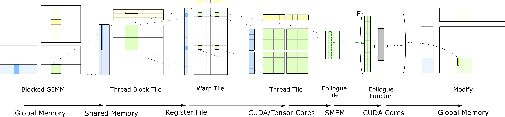

## 第 6 章:CollectiveEpilogue & EVT(融合算子 DSL)

Epilogue 和 Mainloop 是镜像:同样从 gmem→smem(TMA load C)→register(算子)→smem(D 缓存)→gmem(TMA store D)、同用 pipeline、同 swizzle、同 swappable 接口。区别只在:

1. 数据流方向反过来:把 accumulator 通过 TMA store 写到 gmem(TMA store 本身是从 smem 到 gmem,所以 epilogue 还要先把转换后的 D 元素写到 smem)。
2. **可能插一段融合算子**——bias、ReLU、silu、top-K softmax、scale、swizzle output 等。
3. 调度的细颗粒度更细:有专门的 `StagesC` (C load 阶段) / `StagesD` (D store 阶段),可以独立调。

主文件:
- `include/cutlass/epilogue/collective/sm90_epilogue_tma_warpspecialized.hpp`(epilogue 主体)
- `include/cutlass/epilogue/fusion/sm90_visitor_*.hpp` 一族(共 5 个:`tma_warpspecialized` / `compute_tma_warpspecialized` / `load_tma_warpspecialized` / `store_tma_warpspecialized` / `topk_softmax`)— EVT 节点实现。

本章分上下两段:上半 §6.1-§6.3 讲 epilogue 本身机制(StagesC/D dispatch policy、默认 epilogue 路径、TMA Store);下半 §6.4-§6.11 讲 EVT——把 epilogue 能做的事切成 30+ 个 legobrick,用户拼成一段小 AST。

### 本章涉及 CUTLASS 源文件

**Epilogue 主体**(上半):
- `include/cutlass/epilogue/collective/sm90_epilogue_tma_warpspecialized.hpp` — `CollectiveEpilogue` 主体
- `include/cutlass/epilogue/dispatch_policy.hpp:181` — `Sm90TmaWarpSpecialized<StagesC, StagesD, FragmentSize, ReuseSmemC, DelayTmaStore>`
- `include/cutlass/epilogue/collective/builders/sm90_builder.inl` — epilogue builder,内部挑 StagesC/D 默认组合

**EVT 节点**(下半):
- `include/cutlass/epilogue/fusion/sm90_callbacks_tma_warpspecialized.hpp:58/182/494/670` — `Sm90EVT` alias + 4 个 `Sm90LinearCombination` / `Sm90LinCombPerRowBias` / `Sm90LinCombPerRowBiasEltAct` 等内嵌 Sm90EVT 树
- `include/cutlass/epilogue/fusion/sm90_visitor_compute_tma_warpspecialized.hpp` — `Sm90Compute<Fn, ...>` 节点
- `include/cutlass/epilogue/fusion/sm90_visitor_load_tma_warpspecialized.hpp` — 9 种 Load 节点(AccFetch / SrcFetch / ScalarBroadcast / RowBroadcast / ColBroadcast / AuxLoad 等)
- `include/cutlass/epilogue/fusion/sm90_visitor_store_tma_warpspecialized.hpp` — 6 种 Store 节点(AuxStore / ScalarReduction / RowReduction 等)
- `include/cutlass/epilogue/fusion/sm90_visitor_topk_softmax.hpp` — `Sm90TopkSoftmax`
- `include/cutlass/epilogue/fusion/operations.hpp` — ~25 种 predefined fusion tag(`LinearLinear` / `LinCombEltAct` / `LinCombPerRowBias` 等)
- `include/cutlass/epilogue/thread/activation.h:451` — 预置 `SiLu` / `GELU` / `Sigmoid` / `Tanh` / `ThresholdReLU` / `LeakyReLU` / `ReLu` / `Hardswish`
- `include/cutlass/functional.h:607` — `homogeneous_multiply_add<A> : multiply_add<A, A, A>` (三元 FMA)

### 6.0 本章导航

```text
§6.1  Dispatch policy                            ← epilogue 5 个参数
§6.2  默认 epilogue:D = alpha * (A*B) + beta * C
§6.3  TMA Store 路径                              ← register → smem → gmem
§6.4  EVT 入口:为什么单独成段                    ← 30+ legobrick + 12+ partial spec
§6.5  三类节点:compute / load / store            ← 节点全表
§6.6  三个真实 EVT 例子 + 自定义 activation 讨论  ← examples/49 + sm90_callbacks 逐字
§6.7  tree 的"求值"过程                          ← producer / consumer 回调
§6.8  怎么写 EVT(写法 A / B / C)                  ← 手写 vs tag vs 混合
§6.9  典型 fusion 速查                            ← 12+ tag → Sm90EVT 树
§6.10 EVT 与 builder 的关系                       ← partial spec 路由
§6.11 跨章对比                                    ← examples 48/49/50/113
§6.12 章末:读完这一章你该做得到的事               ← 自检 checklist
```

---

## 上半:Epilogue 机制

### 6.1 Dispatch policy

```cpp
template <
  int StagesC_, int StagesD_, int FragmentSize_,
  bool ReuseSmemC_, bool DelayTmaStore_,
  ...
>
struct Sm90TmaWarpSpecialized
    : ... /* 标记本身是 dispatch tag 树的一个 node */ {
  constexpr static int StagesC = StagesC_;
  constexpr static int StagesD = StagesD_;
  constexpr static int FragmentSize = FragmentSize_;
  constexpr static bool ReuseSmemC = ReuseSmemC_;
  constexpr static bool DelayTmaStore = DelayTmaStore_;
};
```

5 个参数分别在做什么:

|参数|默认(由 builder 算)|含义|
|---|---|---|
|`StagesC`|`min(EpiTiles, 4)` (ReuseSmem 时 `max(min(EpiTiles, 4), StagesD+1)`)|C 加载阶段数(从 C 到 register 的流水线深度)|
|`StagesD`|`min(EpiTiles, 2)`|D store 阶段数(register 到 smem 再到 gmem 的流水线深度)|
|`FragmentSize`|`size(EpilogueTileMN{}) / (cooperative ? 256 : 128)`|each store lane 一次写多少个元素|
|`ReuseSmemC`|true iff `sizeof(C)==sizeof(D) && sizeof(D)>8`|是否把"已加载 C 的 smem slot"在 epilogue 末尾继续复用(给 output D 用)|
|`DelayTmaStore`|true iff `C==void && !ptr-array schedule`|是否把 TMA store 推迟到最后(为 swizzle / fusion 留时间)|

`EpilogueScheduleAuto` builder 缺省是哪个具体 `StagesC` / `StagesD` / `FragmentSize` / `ReuseSmemC` / `DelayTmaStore` 组合,看 `include/cutlass/epilogue/collective/builders/sm90_builder.inl`(Ch9 讨论)。

### 6.2 默认 epilogue:`D = alpha * (A*B) + beta * C`

```cpp
// 在 operator() 里的 forward path(简化):
for (...) {  // tiles
  // 1. 加载 C 块
  cute::copy(TiledCopyC, C_block, C_smem_block);
  // 2. mma 累加器已经有了(从 mainloop)
  // 3. alpha/beta 系数乘法
  acc_array = alpha * acc_array + beta * (C_register loaded from C_smem_block);
  // 4. 转换:fp32 acc -> C type
  C_or_D_t_register = ConvertOp{}(acc_array);
  // 5. TMA store
  cute::copy(TiledCopyD, C_or_D_t_register, D_block);
}
```

> **你手写 GEMM 的对照**:你写 epilogue 时就是这几步——读 C、乘 β、乘 α + acc、写 D。CUTLASS 把 alpha/beta/转换类型切成一组 visitor 节点(下面 §6.5)。

### 6.3 TMA Store 路径

跟 TMA Load 镜像——把 register tile 经过 smem 缓存再 store 到 gmem:

```cpp
// TMA Store atom:
auto tma_store_d = SM90_TMA_STORE{};
auto TiledCopyD = make_tiled_copy(tma_store_d, TiledMma);

// use:
cute::copy(TiledCopyD, D_register_tile, D_gmem_block);
```

TMA store 把"分散到多 lane 的 D 元素"高效打包成一个 gmem block 写。

---

## 下半:EVT(Epilogue Visitor Tree)DSL

### 6.4 EVT 入口:为什么单独成段

如果你不需要任何融合,上面 3 节就够。需要 bias / ReLU / silu / scale / per-row scale / top-K softmax 等任意 fusion,就要进入 **EVT(Epilogue Visitor Tree)**。这是 CUTLASS 3.x 的**第二个核心创新**(第一个是 5 层抽象)。

#### 直觉:D = activation( alpha * (A*B) + beta * C + bias + ... )

epilogue 阶段从 mainloop 拿到 fp32 accumulator 后,要做的所有事可以组合成一段"小表达式":

```text
D = activation( alpha * (A*B) + beta * C + bias + scale_per_row + ... + SiLU(top_k(...)) )
```

每一件都是 EVT 里的一个 **node**;节点之间靠"输入输出"连成**树**(其实是 DAG)。

- **叶子节点** = 输入源:`Sm90AccFetch`(从 accumulator 读)、`Sm90SrcFetch<...>`(从 src 张量读)、`Sm90ScalarBroadcast<...>`(标量广播)、`Sm90RowBroadcast<...>`(行向量广播,做 per-row bias)
- **内部节点** = 算子:`Sm90Compute<ComputeFn, ...>`(接 0-N 个输入,产出一个输出)
- **store 节点** = `Sm90AuxStore<...>`(主输出 D 写到 gmem)、`Sm90ScalarReduction<...>` / `Sm90RowReduction<...>`(reduce 到 host)

EVT 的设计:每个 node 是一个 struct,有标准 6 个 hook(`is_producer_load_needed` / `is_C_load_needed` / `get_producer_load_callbacks` / `get_consumer_store_callbacks` 等),编译器按 tree 形态自动生成 producer/consumer 代码。

#### 为什么 EVT 单独成段(3 个理由)

1. **节点种类 30+**——光是"叶子节点"就有 8 种(scalar broadcast / row broadcast / col broadcast / acc fetch / src fetch / aux load × 2 / ptr-array 变体),"内部节点"再加 Sm90Compute + Sm90TopkSoftmax。塞进 epilogue 章会让 epilogue 走样。
2. **partial specialization 多**——CUTLASS 3.x 给常见 fusion 模式(`alpha * acc + beta * C`、`alpha * acc + beta * C + bias`、`alpha * acc + beta * C + per-row scale`、`alpha * acc + bias + silu` 等)都写了**专门的 partial specialization**(在 `sm90_visitor_compute_tma_warpspecialized.hpp` 见到 `struct Sm90TreeVisitor<...> : Sm90VisitorImpl<...>` 这种)。这种"特定 fusion 的 fast path"是 EVT 性能保证的核心,讲不到就抓不到要点。
3. **典型 fusion 不止一个**——典型用户写 `D = alpha * (A*B) + bias`;写 MoE gating `topk + softmax`;写 `D = silu(A*B)`;写 `D = (A*B) .* per_token_scale`(这是 `Sm90AuxStore` 的"element-wise multiply with broadcast"模式)——每种都是不同的 partial spec。

### 6.5 三类节点:compute / load / store

CUTLASS 把 epilogue 拆成 3 种角色,每种是一组 struct:

#### Compute 节点(`sm90_visitor_compute_tma_warpspecialized.hpp`)

| 节点 | 作用 | 典型算子 |
|---|---|---|
| `Sm90Compute<Fn, ...>` | 一个算子 `Fn`,接 0-N 个输入,产出一个输出 | `homogeneous_multiply_add` (= `alpha * acc + beta * C`)、`mul_add`、自定义 `silu` 等 |
| `Sm90TopkSoftmax<...>` | 算 top-K + softmax,专用于 MoE gating 输出 | topk → softmax |

#### Load 节点(`sm90_visitor_load_tma_warpspecialized.hpp`)

| 节点 | 作用 | 数据来源 |
|---|---|---|
| `Sm90AccFetch` | 拿 mainloop 的 accumulator | register(rmem) |
| `Sm90SrcFetch<Element>` | 拿源矩阵 C | gmem(走 TMA load) |
| `Sm90AccFetchGroupedWgrad` | grouped GEMM 反向专用(拿 wgrad 的 acc)| rmem |
| `Sm90ScalarBroadcast<Element, Value>` | 标量广播(常数 α / β) | 编译期常量 |
| `Sm90ScalarBroadcastPtrArray<...>` | ptr-array 调度下的标量 | gmem 指针数组 |
| `Sm90RowBroadcast<...>` | 行向量广播(bias per row)| gmem |
| `Sm90ColBroadcast<...>` | 列向量广播(bias per col)| gmem |
| `Sm90AuxLoad<Element, Stride, ...>` | 任意 stride 的辅助矩阵加载 | gmem |
| `Sm90AuxArrayLoad<...>` | ptr-array 下的辅助矩阵 | gmem 指针数组 |

#### Store 节点(`sm90_visitor_store_tma_warpspecialized.hpp`)

| 节点 | 作用 |
|---|---|
| `Sm90AuxStore<Element, Stride, ...>` | 主输出 D 写到 gmem |
| `Sm90AuxArrayStore<...>` | ptr-array 下的主输出 |
| `Sm90ScalarReduction<...>` | 把一个向量 reduce 成标量(写到 host) |
| `Sm90RowReduction<...>` | 按行 reduce(partial row-sum,典型用作后续 norm)|
| `Sm90ColReduction<...>` | 按列 reduce |
| `Sm90MatrixReduction<...>` | 全矩阵 reduce |

### 6.6 三个真实 EVT 例子

#### 6.6.1 默认 epilogue:`D = alpha * (A*B) + beta * C`

这是 `examples/49_hopper_gemm_with_collective_builder/49_collective_builder.cu` 第 291-299 行**逐字复制**:

```cpp
using CustomEVT =
  cutlass::epilogue::fusion::Sm90EVT<
    cutlass::epilogue::fusion::Sm90Compute<cutlass::homogeneous_multiply_add, ElementD, ElementCompute, RoundStyle>, // beta * C + (alpha * acc)
      cutlass::epilogue::fusion::Sm90ScalarBroadcast<ElementScalar>, // beta
      cutlass::epilogue::fusion::Sm90SrcFetch<ElementC>,              // C
      cutlass::epilogue::fusion::Sm90EVT<
        cutlass::epilogue::fusion::Sm90Compute<cutlass::multiplies, ElementCompute, ElementCompute, RoundStyle>, // alpha * acc
          cutlass::epilogue::fusion::Sm90ScalarBroadcast<ElementScalar>, // alpha
          cutlass::epilogue::fusion::Sm90AccFetch                       // acc
      >
  >;
```

**树结构**:
```
root = homogeneous_multiply_add(beta, C, inner)        // beta * C + (alpha * acc)
  ├── beta (ScalarBroadcast)
  ├── C (SrcFetch)
  └── inner = multiplies(alpha, acc)                  // alpha * acc
       ├── alpha (ScalarBroadcast)
       └── acc (AccFetch)
```

**关键观察**(对应源码 `Sm90LinearCombination` 定义,`sm90_callbacks_tma_warpspecialized.hpp:182-190`):

- `homogeneous_multiply_add<A>` 是 `template <typename A> struct homogeneous_multiply_add : public multiply_add<A, A, A>`(`functional.h:607`)。继承自 `multiply_add<A, B, C>`,operator 签名是 `(a, b, c) → a*b + c`。
- `homogeneous_*` 前缀的算子都强制三个参数同一类型,只取 1 个 template 参数——这是为了绕过某些 Clang 版本对 `template template parameter` 单参数匹配的限制(见 `sm90_visitor_compute_tma_warpspecialized.hpp:60-83` 注释)。
- 默认 epilogue 不需要手写——`Cutlass 3.x` 提供 `fusion::LinearCombination<...>` tag(见 §6.8 "写法 B"),`CollectiveBuilder` 自动选中 `Sm90LinearCombination`。

#### 6.6.2 加 per-row bias:`D = alpha * (A*B) + beta * C + bias`

源码对应 `Sm90LinCombPerRowBias`(`sm90_callbacks_tma_warpspecialized.hpp:494-514`),**逐字复制**:

```cpp
using Sm90LinCombPerRowBias =
  cutlass::epilogue::fusion::Sm90EVT<
    cutlass::epilogue::fusion::Sm90Compute<cutlass::homogeneous_multiply_add, ElementOutput, ElementCompute, RoundStyle>, // beta * C + (alpha * acc + bias)
      cutlass::epilogue::fusion::Sm90ScalarBroadcast<ElementScalar, Stride<_0,_0,int64_t>>, // beta
      cutlass::epilogue::fusion::Sm90SrcFetch<ElementSource>,                              // C
      cutlass::epilogue::fusion::Sm90EVT<
        cutlass::epilogue::fusion::Sm90Compute<cutlass::homogeneous_multiply_add, ElementCompute, ElementCompute, RoundStyle>, // alpha * acc + bias
          cutlass::epilogue::fusion::Sm90ScalarBroadcast<ElementScalar, Stride<_0,_0,int64_t>>, // alpha
          cutlass::epilogue::fusion::Sm90AccFetch,                                            // acc
          cutlass::epilogue::fusion::Sm90ColBroadcast<0, CtaTileShapeMNK, ElementBias, ElementCompute, Stride<_1,_0,int64_t>, AlignmentBias> // bias
      >
  >;
```

**树结构**:
```
root = homogeneous_multiply_add(beta, C, inner)     // beta * C + (alpha * acc + bias)
  ├── beta
  ├── C
  └── inner = homogeneous_multiply_add(alpha, acc, bias)  // alpha * acc + bias
       ├── alpha
       ├── acc
       └── bias (ColBroadcast,per-row)
```

**对比 §6.6.1**:bias 是作为**内层 FMA 的第三个参数**加入的——这是为什么 bias 的 stride 是 `_1,_0`(per-row)而不是 scalar。

#### 6.6.3 加 activation + per-row bias:`D = activation(alpha*acc + beta*C + bias)`

源码对应 `Sm90LinCombPerRowBiasEltAct`(`sm90_callbacks_tma_warpspecialized.hpp:670-685`),**逐字复制**:

```cpp
using Sm90LinCombPerRowBiasEltAct =
  cutlass::epilogue::fusion::Sm90EVT<
    cutlass::epilogue::fusion::Sm90Compute<ActivationFn, ElementOutput, ElementCompute, RoundStyle>,
      cutlass::epilogue::fusion::Sm90LinCombPerRowBias<CtaTileShapeMNK, ElementCompute, ElementCompute, ElementBias, ElementSource, ElementScalar, AlignmentBias, RoundStyle>
  >;
```

**树结构**:
```
root = Sm90Compute<ActivationFn>(inner)   // activation = 一元算子
  └── inner = Sm90LinCombPerRowBias       // = alpha*acc + beta*C + bias
```

`ActivationFn` 是 `template <class> class` 模板 functor。CUTLASS 内置 `SiLu` / `GELU` / `Sigmoid` / `Tanh` / `ThresholdReLU` / `LeakyReLU` / `ReLu` / `Hardswish` 等(在 `cutlass/epilogue/thread/activation.h`)。

#### 6.6.4 关于 activation 的自定义

CUTLASS 已经在 `cutlass/epilogue/thread/activation.h:451-460` 预置了 `SiLu`:

```cpp
template <typename T>
struct SiLu {
  static const bool kIsHeavy = true;
  CUTLASS_HOST_DEVICE
  T operator()(T const &value) const {
    Sigmoid<T> sigmoid;
    return value * sigmoid(value);
  }
};
```

直接用 `ActivationFn = SiLu`(注意:大写 S,大写 L,小写 u,**不是** `Silu`/`silu`/`HomogeneousSilu`)。CUTLASS 故意不内建"全部 activation"——只内建常见数学运算 + 几个常用 activation;其他需要用户写 `template <class> class` 形式的 functor。

**(注意**:`Sm90Compute` 的 ComputeFn 必须是 `template <class> class`(单模板参数),这是 Clang 限制——见 `sm90_visitor_compute_tma_warpspecialized.hpp:60-83` 注释。如果你的 functor 有多个模板参数,可以用一个 1 模板参数的子类继承原类,绕开这个限制,例如 `homogeneous_multiply_add` 就是这么做的(`functional.h:607`,跟 §6.6.1 一致)。)**

### 6.7 tree 的"求值"过程

跟普通的 AST 求值不一样——EVT 在 epilogue 阶段是按 producer / consumer warp 分别触发不同节点的回调:

```cpp
// Producer warp 端(在 epilogue 开始前):
void begin_prologue() {
  for (auto& node : tree.post_order()) {
    if (node.is_producer_load_needed()) {
      auto callbacks = node.get_producer_load_callbacks(args);
      // 比如 C 节点 / bias 节点需要 TMA 加载,这里发起
      cute::copy(node.tiled_copy(), node.partition_S(src), node.partition_D(smem));
    }
  }
}

// Consumer warp 端(在每个 tile 的 epilogue):
Array<ElementOutput, FragmentSize> result = tree.visit(frg_acc, epi_v, epi_m, epi_n);
//   ↑ 这是一个递归调用:从 root 开始,root 的 visit() 调它自己的 children's visit(),
//     children's visit() 再调它们的 children 的,直到叶子(从 accumulator / src / scalar / 加载好的 smem 拿值)
//     最后从 leaf 一路返回,每个内部节点做自己的算子
```

`tree.visit()` 的递归形态让**算子组合性极强**——你可以把任意 depth 的 fusion 树塞进去,只要每个节点都有 6 个标准 hook,编译器就能生成 epilogue 代码。

### 6.8 怎么写 EVT(写法 A / B / C)

#### 写法 A:手写 `Sm90EVT<...>` 节点(精细控制)

延续 §6.6.1 的 `D = alpha*acc + beta*C` 例子,对应 `examples/49/49_collective_builder.cu:291-299`:

```cpp
// 在 CollectiveEpilogue 的 Arguments 里:
using EpilogueEVT =
  cutlass::epilogue::fusion::Sm90EVT<
    cutlass::epilogue::fusion::Sm90Compute<cutlass::homogeneous_multiply_add, ElementD, ElementCompute, RoundStyle>, // beta * C + (alpha * acc)
      cutlass::epilogue::fusion::Sm90ScalarBroadcast<ElementScalar>,
      cutlass::epilogue::fusion::Sm90SrcFetch<ElementC>,
      cutlass::epilogue::fusion::Sm90EVT<
        cutlass::epilogue::fusion::Sm90Compute<cutlass::multiplies, ElementCompute, ElementCompute, RoundStyle>, // alpha * acc
          cutlass::epilogue::fusion::Sm90ScalarBroadcast<ElementScalar>,
          cutlass::epilogue::fusion::Sm90AccFetch
      >
  >;
```

#### 写法 B:用 **predefined fusion operations** tag(更短,推荐新手)

`include/cutlass/epilogue/fusion/operations.hpp` 提供 ~25 个 tag,对应常见 fusion 模式。`CollectiveBuilder` 看到 tag 自动 dispatch 到对应的 `Sm90EVT` partial spec(`sm90_callbacks_tma_warpspecialized.hpp:74` 等)。

```cpp
// 用 LinearCombination tag 替换手写的 Sm90LinearCombination
using DefaultOperation = cutlass::epilogue::fusion::LinearCombination<
    ElementD, ElementCompute, ElementC, ElementScalar, RoundStyle>;

// Builder 用法:
using CollectiveEpilogue = typename cutlass::epilogue::collective::CollectiveBuilder<
    cutlass::arch::Sm90, /* OpClass */,
    /* ... dtype + alignment 元组 ... */,
    TileShape, ClusterShape,
    StageCountType, /* ... */,
    DefaultOperation   // ← tag,不是手写的 EVT
>::CollectiveOp;
```

**两种写法对比**:

|维度|手写 `Sm90EVT<...>`|Tag `LinearCombination<...>` 等|
|---|---|---|
|代码长度|长(显式列所有 node)|短(几个 template 参数)|
|调试粒度|细(节点类型一一可见)|粗(builder 内部 macro 展开)|
|覆盖度|无限制(任意树)|~25 种 predefined(见 §6.9 速查表)|
|性能|相同(partial spec 路由给编译器)|相同|

**实际项目经验**:

- **新手先写 tag**——`LinearCombination` / `LinCombPerRowBias` / `LinCombEltAct` 已经 cover 90% 常见 fusion,Builder 替你算 stage / copy atom / layout,不会出错。
- **特殊需求手写**——比如 `examples/49` 的 `CustomEVT`(`alpha*acc + beta*C` 但手写)是为了演示 EVT;真正生产代码直接用 `LinearCombination<...>` 即可。
- **看 in-tree 代码**会发现 `examples/68_*` (blockwise scaling) 全部用 tag(`ScaledLinCombPerRowBiasEltAct` 等);`examples/45_dual_gemm` 之类自己造新 fusion 的才会手写 EVT。

#### 写法 C:混合(常见 fusion 用 tag + 自定义节点嵌入手写)

实际项目最常见的——`LinCombPerRowBiasEltAct<ActivationFn, ...>` 的 `ActivationFn` 是 template 参数,用户可以传 `SiLu` / 自定义 functor,Builder 自动把 activation 节点嵌入 `Sm90EVT` 树。

**写法 A vs B vs C 都不"竞争"**——A 是基础,B/C 是 Builder 提供的便利。

### 6.9 典型 fusion 速查

源码对应 tag 在 `include/cutlass/epilogue/fusion/operations.hpp`(全部 `struct ... : FusionOperation { ... };` 定义,约 25 种):

| 实际支持的 fusion | Tag(写法 B) | 内部 Sm90EVT(写法 A) |
|---|---|---|
| `D = alpha * acc + beta * C` | `LinearCombination<ElementD, ElementCompute, ElementC, ElementScalar, RoundStyle>` | `Sm90LinearCombination` (§6.6.1) |
| `D = activation(alpha*acc + beta*C)` | `LinCombEltAct<ActivationFn, ...>` | `Sm90LinCombEltAct` |
| `D = alpha*acc + beta*C + per-row bias` | `LinCombPerRowBias<...>` | `Sm90LinCombPerRowBias` (§6.6.2) |
| `D = activation(alpha*acc + beta*C + per-row bias)` | `LinCombPerRowBiasEltAct<ActivationFn, ...>` | `Sm90LinCombPerRowBiasEltAct` (§6.6.3) |
| `D = alpha*acc + beta*C + per-col bias` | `LinCombPerColBias<...>` | `Sm90LinCombPerColBias` |
| `D = activation(alpha*acc + beta*C + per-col bias)` | `LinCombPerColBiasEltAct<ActivationFn, ...>` | `Sm90LinCombPerColBiasEltAct` |
| `D = per-row alpha*acc + per-row beta*C + per-row bias` | `PerRowLinCombPerRowBias<...>` | 同名 |
| `D = activation(per-row alpha*acc + per-row beta*C + per-row bias)` | `PerRowLinCombPerRowBiasEltAct<ActivationFn, ...>` | 同名 |
| `D = scale_a*scale_b*alpha*acc + scale_c*beta*C + per-row bias` | `ScaledLinCombPerRowBias<...>` | `Sm90ScaledLinCombPerRowBias` |
| `D = block-scale GEMM` | `LinCombBlockScaleFactor<...>` | 同名 |
| `D = top-k softmax(GEMM)` | `LinCombTopKSoftmaxCol<...>` | 同名 |
| `D = activation(GEMM) * scale_d` + `amax_d = max(abs(D))` | `ScaledLinCombPerRowBiasEltActAmaxAux<...>` | 同名 |

**不在表里的 fusion**:手写 `Sm90EVT<...>`(写法 A)。比如 `examples/45_dual_gemm/thread/left_silu_and_mul.h` 这种 dual GEMM + silu + multiply 的非标准 fusion。

### 6.10 EVT 与 builder 的关系

EVT 节点是 epilogue 的**输入**。builder 看 EVT 类型,落到对应的 partial specialization:

- 默认 epilogue = `Sm90LinearCombination`(`sm90_callbacks_tma_warpspecialized.hpp:182` 的内嵌 `Sm90EVT` 树),结构见 §6.6.1——`Sm90Compute<homogeneous_multiply_add>` 为根,3 个直接 child:`ScalarBroadcast(beta)` / `SrcFetch(C)` / 嵌套的 `Sm90EVT<Sm90Compute<multiplies>, ScalarBroadcast(alpha), AccFetch>` —— builder 走默认 epilogue。
- 含 EVT 的 epilogue = builder 看你给的 EVT 类型,落到对应的 `CollectiveEpilogue` partial spec(`include/cutlass/epilogue/collective/builders/sm90_builder.inl` 里)。

Ch9 builder 章会讲 builder 怎么 dispatch 到 EVT-aware 的 partial spec。

### 6.11 跨章对比

|Example|在 epilogue 上加了什么|在哪|
|---|---|---|
|`examples/48_hopper_warp_specialized_gemm/`|默认|一切从零|
|`examples/49_hopper_gemm_with_collective_builder/`|加 EVT bias + ReLU fusion + 改 schedule|Ch1|
|`examples/50_hopper_gemm_with_epilogue_swizzle/`|swizzle output(让 D 的 gmem 写入布局更好)|`examples/50_*/50_*.cu`|
|`examples/113_hopper_gemm_activation_fusion/`|多 activation fusion(bias + gelu + scale)|`examples/113_*/113_*.cu`|



### 6.12 章末:读完这一章你该做得到的事

#### 上半(epilogue 机制)

- ✅ 知道 epilogue dispatch policy 5 个参数分别影响什么(StagesC、StagesD、FragmentSize、ReuseSmemC、DelayTmaStore)。
- ✅ 知道默认 epilogue 路径(`D = alpha*acc + beta*C`)和 TMA Store 怎么把 register tile 写回 gmem。
- ✅ 知道 EVT 跟 PyTorch 的 chain 是两回事——CUTLASS 是显式 AST 不是基于 lambda fusion。

#### 下半(EVT DSL)

- ✅ 看到 `Sm90EVT<Sm90Compute<...>, Child0, Child1, ...>` 能讲出树结构——第一个参数是 root node,后面是它的输入 child。
- ✅ 区分 compute / load / store 三类节点各 30+ 种,知道什么时候用哪类。
- ✅ 能手写一个 `D = alpha*acc + beta*C`(对应 `Sm90LinearCombination`,见 §6.6.1)和一个 `D = alpha*acc + beta*C + per-row bias`(对应 `Sm90LinCombPerRowBias`,见 §6.6.2)的 EVT 树。
- ✅ 知道 `homogeneous_multiply_add<A>` = `multiply_add<A, A, A>` = `(a, b, c) → a*b + c`,是三元算子;对应源码 `functional.h:607`。
- ✅ 知道 CUTLASS 预置的 activation 包括 `SiLu` / `GELU` / `Sigmoid` / `Tanh` / `ThresholdReLU` / `LeakyReLU` / `ReLu` / `Hardswish`(在 `cutlass/epilogue/thread/activation.h`),`SiLu` 是 `template <typename T> struct SiLu`,**直接用**。
- ✅ 能区分写法 A(手写 `Sm90EVT<...>`) vs 写法 B(`operations.hpp` 里的 tag 如 `LinearCombination` / `LinCombPerRowBiasEltAct`),知道实际项目新手先用 tag,特殊需求手写。
- ✅ 看 `examples/113_hopper_gemm_activation_fusion/`(`ActivationFn = SiLu` / `ReLu` / `Identity`)的 epilogue 能讲清 `Sm90Compute<ActivationFn, ...>` 节点。
- ✅ 知道 builder 怎么按 EVT 类型选 partial spec(细节看 Ch9 §9.3 epilogue builder)。

---