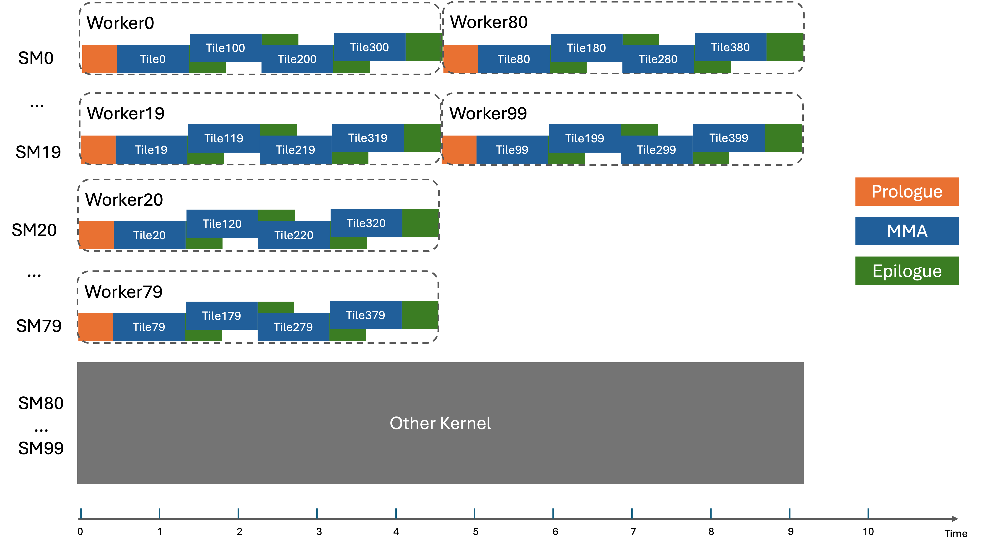

## 第 7 章:Kernel orchestrator + TileScheduler(调度器族对比)

这一章读 `include/cutlass/gemm/kernel/sm90_gemm_tma_warpspecialized.hpp` + `sm90_tile_scheduler.hpp` + `static_tile_scheduler.hpp` + `tile_scheduler_params.h` + `sm90_tile_scheduler_stream_k.hpp` + `sm90_tile_scheduler_group.hpp` + `sm100_tile_scheduler.hpp` + `sm100_tile_scheduler_stream_k.hpp` + `sm100_tile_scheduler_group.hpp` + `sm100_static_tile_scheduler.hpp`。

把 Kernel orchestrator 和 TileScheduler 合并讲的原因:**它们在一个 kernel 的入口一起出现**——`operator()` 调 first `tile_scheduler.fetch_next_work(...)`,得到 (m, n) 切片,然后跑 mainloop + epilogue。

本章主线:把调度器族**挨个拆开**(每个调度器的内部数据流、`WorkTileInfo` 形状、reduction 机制、swizzle/raster 数学),再回到 kernel orchestrator 那段不变的骨架代码——你会发现,**orchestrator 对所有调度器是一样的**,只有调度器自己知道"下一个 tile 是什么"。

### 本章涉及 CUTLASS 源文件

- `include/cutlass/gemm/kernel/sm90_gemm_tma_warpspecialized.hpp` — `GemmUniversal` 主体(operator / Arguments / Params / SharedStorage)
- `include/cutlass/gemm/kernel/sm90_gemm_warpspecialized.hpp` / `_pingpong.hpp` / `_cooperative.hpp` — kernel 编排层 3 个变体
- `include/cutlass/gemm/kernel/sm90_tile_scheduler.hpp:40` — `PersistentTileSchedulerSm90`(默认)
- `include/cutlass/gemm/kernel/sm90_tile_scheduler_stream_k.hpp:49` — `PersistentTileSchedulerSm90StreamK`
- `include/cutlass/gemm/kernel/sm90_tile_scheduler_group.hpp:47` — `PersistentTileSchedulerSm90Group`
- `include/cutlass/gemm/kernel/sm100_tile_scheduler.hpp:59` + `sm100_tile_scheduler.hpp:200` — Sm100 Persistent + DynamicPersistent
- `include/cutlass/gemm/kernel/sm100_static_tile_scheduler.hpp:298` — `StaticPersistentTileScheduler100`
- `include/cutlass/gemm/kernel/tile_scheduler.hpp:86-298` — `TileSchedulerSelector` 8 个 partial spec + 5 个 tag(`PersistentScheduler` / `StreamKScheduler` / `GroupScheduler` / `DynamicPersistentScheduler` / `StaticPersistentScheduler`)
- `include/cutlass/gemm/kernel/static_tile_scheduler.hpp` — `StaticPersistentTileScheduler<Tag>` CRTP 公共模板

### 7.0 本章导航

```text
§6.1  Kernel 类(GemmUniversal<...>)的 SFINAE 路由       ← 入口
§6.2  Arguments / Params / SharedStorage                  ← host 端 3 件套
§6.3  operator()(Params, smem_buf) 入口                   ← device kernel 起点
§6.4  Producer / Consumer 主循环(俯视)                  ← 6 个 helper 接力
§6.5  调度器族(6 个调度器,6.5.1-6.5.6)                    ← Persistent / StreamK / Group / Dynamic / Static / sm100 变体
§6.6  速查表 + 决策树 + 图配                              ← 横向对比 + 实战选型
§6.7  章末:读完这一章你该做得到的事                       ← 自检 checklist
```

读法建议:

- **第一次读**:§6.1 → §6.4 一把过,先把 kernel 骨架 + 调度器接口契约装进脑子。
- **第二次按需**:调度器族对比(§6.5.1-§6.5.6)按你项目里的形状选:大 M×N 走 §6.5.1、K-bound 走 §6.5.2、MoE/grouped 走 §6.5.3、Sm100 走 §6.5.4-§6.5.6。
- **实战选型**:§6.6.1 决策树 + §6.6 速查表
- **自检**:§6.7 checklist

### 7.1 Kernel 类(`GemmUniversal<...>`)的 SFINAE 路由

```cpp
template <
  class ProblemShape_, class CollectiveMainloop_, class CollectiveEpilogue_, class TileScheduler_
>
class GemmUniversal<
  ProblemShape_, CollectiveMainloop_, CollectiveEpilogue_, TileScheduler_,
  cute::enable_if_t<
    cute::is_base_of_v<KernelTmaWarpSpecialized,
                       typename CollectiveMainloop_::DispatchPolicy::Schedule>
  >
> {
  ...
};
```

`enable_if_t<is_base_of_v<KernelTmaWarpSpecialized, Mainloop::DispatchPolicy::Schedule>>` — 这一段是"如果 mainloop 的 schedule tag 是 `KernelTmaWarpSpecialized`(或其派生),我匹配这个 partial specialization"。

为什么这样:有 5+ 种 `Kernel*` partial specialization(TmaWarpSpecialized、Pingpong、Cooperative、Pure、非 warp-spec 等)。CUTLASS 不希望用 `if-else` 选——它用 SFINAE 路由,用户写什么 mainloop schedule tag,就匹配什么 kernel。

同样的 SFINAE 路由对 TileScheduler 也成立:写 `PersistentScheduler` 就匹配 `Persistent*` 派系;写 `StreamKScheduler` 就匹配 stream-K partial spec;写 `GroupScheduler` 就匹配 grouped-GEMM partial spec。

### 7.2 Arguments / Params / SharedStorage

```cpp
struct Arguments {
  GemmUniversalMode mode;           // kGemm / kGemmSplitK / kGroupedGemm / ...
  ProblemShape problem_shape;       // (M, N, K)
  typename CollectiveMainloop::Arguments mainloop;
  typename CollectiveEpilogue::Arguments epilogue;
  KernelHardwareInfo hw_info;       // SM count / max blocks per SM
  typename TileScheduler::Arguments scheduler;  // 关键字段取决于调度器 tag
};

struct Params {
  typename CollectiveMainloop::Params mainloop;
  typename CollectiveEpilogue::Params epilogue;
  typename TileScheduler::Params    scheduler;
  ProblemShape problem_shape;
  KernelHardwareInfo hw_info;
};

// internal SharedStorage:
struct SharedStorage {
  union TensorStorage {
    typename CollectiveMainloop::TensorStorage mainloop;
    typename CollectiveEpilogue::TensorStorage epilogue;
  } tensors;

  struct PipelineStorage : cute::aligned_struct<16, _1> {
    typename CollectiveMainloop::PipelineStorage mainloop;
    typename CollectiveEpilogue::PipelineStorage epi_load;
    typename TileScheduler::SharedStorage          scheduler;  // 调度器的 smem
  } pipelines;
};
```

pattern 你已经熟了: union(主要内存)、pipeline storage(流水线屏障)、scheduler 状态。**`scheduler` 这一块是调度器相关的**——`StaticPersistent` 是 0 字节空 storage;`StreamK` 也基本 0 字节(因为 reduction workspace 走 gmem);**只有 SM100 Persistent 和 Group scheduler 真有 smem 状态**(CLC pipeline + response buffer / producer-consumer pipeline + response buffer)。

### 7.3 `operator()(Params, smem_buf)` 入口

```cpp
CUTLASS_DEVICE void operator()(Params const& params, char* smem_buf) {
  // 计算 thread / warp 角色
  int warp_idx             = threadIdx.x / 32;
  int warp_group_idx       = warp_idx / 4;     // 4 warp/warp group
  int lane_predicate       = cute::elect_one_sync();
  bool is_main_producer    = (warp_group_idx == 0);   // producer warp group
  bool is_main_consumer    = (warp_group_idx == 1);   // consumer warp group
  WarpGroupRole warp_group_role = is_main_producer ? Producer : Consumer;

  // SharedMemory 划分
  TensorStorage&   shared_storage_tensors   = *reinterpret_cast<TensorStorage*>(smem_buf);
  PipelineStorage& shared_storage_pipelines = *reinterpret_cast<PipelineStorage*>(
      smem_buf + sizeof(TensorStorage));

  // 所有 CTA 单线程预取 TMA descriptor
  if (warp_idx == 0 && lane_predicate) {
    CollectiveMainloop::prefetch_tma_descriptors(params.mainloop);
    CollectiveEpilogue::prefetch_tma_descriptors(params.epilogue);
  }

  // 准备 mainloop pipeline 参数
  typename CollectiveMainloop::PipelineParams mainloop_pipe_params;
  if (warp_group_role == Producer) {
    mainloop_pipe_params.role = MainloopPipeline::ThreadCategory::Producer;
  }

  // CTA 内的"互相 barrier"被组装好
  cutlass::arch::wait_for_dependent_instruction();
  __syncthreads();

  // 主循环:每个 CTA 处理多个 tile(persistent)
  while (true) {
    // 1) 决定本 CTA 这一轮跑哪个 tile — fetch_next_work 返回 pair
    auto [work_tile_info, increment_pipe] =
        TileScheduler::fetch_next_work(params.scheduler);
    auto [m_coord, n_coord, l_coord] = work_tile_info;     // WorkTileInfo 只有 M/N/L idx

    if (!work_tile_info.is_valid()) {
      break;   // 全部分配完了
    }

    // 2) 计算在本 tile 内 K 维 split(用于 K-loop 边界) — K 不在 WorkTileInfo 里
    int k_tile_count = TileScheduler::get_work_k_tile_count(work_tile_info, problem_shape, tile_shape);
    int k_tile_idx   = TileScheduler::get_work_k_tile_start(work_tile_info);

    // 3) Producer 主循环
    if (warp_group_role == Producer) {
      CollectiveMainloop::load_init(...);
      PipelineState write_state = make_producer_start_state<MainloopPipeline>();
      // ... 详见 6.4
    }

    // 4) Consumer 主循环
    if (warp_group_role == Consumer) {
      CollectiveMainloop::load_init(...);
      PipelineState read_state{};   // default-construct,初相位与 producer 反相
      // ... 详见 6.4
    }

    // 5) 收尾:epilogue
    CollectiveEpilogue::operator()(..., work_tile_info);

    // 6) cluster barrier(等待同 cluster 的兄弟 CTA 都跑完本 tile 才进入下一 tile)
    cluster_arrive();
    cluster_wait();
  }
}
```

注释:

- `cute::elect_one_sync()`:32 lane 里选 1 个 candidate,(true/false)标记谁做幂等的"单线程"操作(如 TMA descriptor 预取)。
- `WarpGroupRole { Producer, Consumer }` + `ProducerWarpRole { MainloopEpilogue, Warp1, Warp2, Warp3 }`:更细的角色切分在 epilogue / 多 producer 的变体里出现。
- `cluster_arrive` / `cluster_wait`:cluster 内 CTA 一起同步(在本例子是让同 cluster 的所有 CTA 都跑完本 tile 才进入下一 tile)。
- **`k_tile_count` 和 `k_tile_idx` 在不同调度器下含义不同**(关键!):
  - `Persistent / StaticPersistent / DynamicPersistent`:`k_tile_count = ceil(K / tile_K)`,`k_tile_idx = 0`——一个 worker 包整个 K 轴。
  - `StreamK`:`k_tile_count` 是本 worker 实际算的 K 子区间长度,**未必等于完整 K**;`k_tile_idx` 是 K 子区间的起点。
  - `Group`:`k_tile_count = ceil(K / tile_K)`,`k_tile_idx = 0`(每个 group 的 K 是独立的)。

### 7.4 Producer / Consumer 主循环(俯视)

```text
[t=0]   Producer 把 K=0  拉入 smem stage 0
        Consumer 等 stage 0 准备好

[t=1]   Producer 把 K=32 拉入 smem stage 1
        Consumer 在 smem stage 0 做 mma

[t=2]   Producer 把 K=64 拉入 smem stage 2
        Consumer 在 smem stage 1 做 mma

[t=3]   Producer 等 stage 0 空出来(load_init 之初预留 producer_ahead = N stages 的空档)
        Consumer 在 smem stage 2 做 mma

        + Producer 把 K=96 拉入 smem stage 0(覆盖)
        ...
```

代码骨架:

```cpp
// Producer 主循环(简化为同步版,真实代码是非阻塞)
if (role == Producer) {
  CUTLASS_PRAGMA_NO_UNROLL  // Producer 是异步发起 TMA,不要 #pragma unroll
  for (int k_tile = 0; k_tile < K_tiles; ++k_tile) {
    // 等本 producer stage 的 smem slot 出来
    mainloop_pipeline.producer_acquire(write_state);
    // 用 TMA 拉
    CollectiveMainloop::load(params.mainloop, mainloop_pipeline, ..., write_state);
    // commit — consumer 可以 mma 这一 stage 了
    mainloop_pipeline.producer_commit(write_state);
    ++write_state;
  }
}

// Consumer 主循环
if (role == Consumer) {
  CUTLASS_PRAGMA_UNROLL  // Consumer 是同步执行 WGMMA,可以 unroll
  for (int k_tile = 0; k_tile < K_tiles; ++k_tile) {
    // 等本 consumer 的 smem slot 准备好
    mainloop_pipeline.consumer_wait(read_state);
    // 用 WGMMA 计算
    CollectiveMainloop::mma(params.mainloop, accumulators, shared_tensors, ..., read_state);
    // release — producer 可以更新这一 stage
    mainloop_pipeline.consumer_release(read_state);
    ++read_state;
  }
}
```

注意 6 个 helper 的**调用顺序**(再次强调,这对应 Ch4):

1. `load_init`(在 producer / consumer 进入 while 循环前各做一次)
2. Producer 循环:`producer_acquire → load → producer_commit → ++state` × N
3. Consumer 循环:`consumer_wait → mma → consumer_release → ++state` × N
4. `load_tail`(收尾:最后一次 consumer_wait + mma,清空 pipeline)

> **你手写 GEMM 的对照**:你大概自己写过 `is_producer = warpIdx < 4` 这种分支 + 双 queue(buffer 数组)。CUTLASS 把它"封装"成 `PipelineTmaAsync<Stages>`,你不用手写 barrier 数组,但看到的"6 个 helper 接力"完全等价。

---

## 第二部分:调度器族对比(本章核心)

CUTLASS 3.x 把"决定下一个 tile 是哪一个"这件事抽成一个**多态 tag 家族**。所有调度器对外提供**同一个接口**——`fetch_next_work(...)` + `WorkTileInfo { M, N, L, ... }` + `compute_epilogue / fixup / separate_reduction`——所以 kernel orchestrator 那段代码(§6.3)**完全不变**;换调度器只是换 tag。

调度器分两大派:

- **静态(static)**:work 划分、grid 大小完全在 host 端算好,device 端用 `blockIdx` 直接查表。`Persistent` / `StaticPersistent` / `StreamK` / `Group` 都属于这一类。
- **动态(dynamic,Blackwell 专用)**:work 不预分配,每个 CTA 通过硬件 CLC(`clusterlaunchcontrol`)指令**动态问 hardware 要下一组 CTA id**。`DynamicPersistent`(sm100)、sm100 stream-K / Group 都基于这套。

下面对每个调度器单独拆。

### 7.5.1 `PersistentTileSchedulerSm90` (默认 tag) —— 静态持久调度的"默认派"

文件:`include/cutlass/gemm/kernel/sm90_tile_scheduler.hpp`(默认)。

**思路**:**persistent kernel** = 每个 CTA 在一个 SM 上跑、循环摊派多个 tile。Work 划分在 host 端完成:把 `(tiles_m, tiles_n, tiles_l)` 平铺成一个一维 `linear_idx`,device 端把 `linear_idx` 反解回 `(M, N, L)` 切片。

```cpp
class PersistentTileSchedulerSm90 : public StaticPersistentTileScheduler<PersistentTileSchedulerSm90> {
  ...
};
```

CRTP 继承了一个 `StaticPersistentTileScheduler<Tag>` 公共模板(`include/cutlass/gemm/kernel/static_tile_scheduler.hpp`),Tag 用自己(`PersistentTileSchedulerSm90`),用于 `static_cast` 反射出调度器的 tags(`get_work_idx_m_and_n`)。

#### 关键参数

`Arguments`(用户填,`tile_scheduler_params.h`)只暴露两个字段:

```cpp
struct Arguments {
  int max_swizzle_size = 0;                            // 1 / 2 / 4 / 8
  RasterOrderOptions raster_order = RasterOrderOptions::Heuristic;  // Heuristic / AlongM / AlongN
};
```

实际 `Params`(scheduler 内部算完后固化,`PersistentTileSchedulerSm90Params` 在 `tile_scheduler_params.h:87`)大致是:

```cpp
struct PersistentTileSchedulerSm90Params {
  FastDivmodU64Pow2 divmod_cluster_shape_major_{};    // cluster major 维快速除/模
  FastDivmodU64Pow2 divmod_cluster_shape_minor_{};
  FastDivmodU64    divmod_batch_{};
  FastDivmodU64    divmod_cluster_blk_major_{};

  uint64_t blocks_per_problem_ = 0;                   // 总 CTA 数
  int32_t  log_swizzle_size_   = 0;                   // log2(max_swizzle_size)
  RasterOrder raster_order_    = RasterOrder::AlongN; // 解析后的 raster
  uint32_t problem_tiles_m_, problem_tiles_n_, problem_tiles_l_;
  uint32_t cluster_shape_m_,   cluster_shape_n_;
};
```

`raster_order` 决定 "tile 是按 row-major 还是 col-major 摊派到 CTA id":

- `AlongN` = N 先推进(横向扫) — **L-shape (M << N) GEMM** 时 L2 命中率更高
- `AlongM` = M 先推进(纵向扫) — **L-shape (N << M)** 同理
- `Heuristic` = 自动选(根据矩阵形状)

`max_swizzle_size` 决定"多大块长的 L2 reuse":1 是无 swizzle、8 是 8×8 swizzle block(swizzle 后同 L2 set 被多个 CTA 命中)。`max_swizzle_size = 4` 是普适默认。

#### 工作算法

`StaticPersistentTileScheduler` 把所有 CTA 编号当成一个一维 `current_work_linear_idx_`:

```cpp
// 构造时(每个 CTA 一次):把 blockIdx → linear_idx
if (raster_order_ == RasterOrder::AlongN) {
  current_work_linear_idx_ = blockIdx.x + blockIdx.y * gridDim.x;
} else {
  current_work_linear_idx_ = blockIdx.x * gridDim.y + blockIdx.y;
}
total_grid_size_ = gridDim.x * gridDim.y * gridDim.z;

// 推进:每个 tile 处理完一次 +N
void advance_to_next_work(uint32_t advance_count = 1) {
  current_work_linear_idx_ += total_grid_size_ * advance_count;
}

// fetch_next_work — kernel orchestrator 调的就是它
auto fetch_next_work(WorkTileInfo prev) {
  if (continue_current_work(prev)) return {prev, true};
  advance_to_next_work();
  return {get_current_work(), true};
}

// 反解 linear_idx → (m, n) 切片(在 PersistentTileSchedulerSm90::get_work_idx_m_and_n 里)
get_work_idx_m_and_n(blk_per_grid_dim, divmod_major, divmod_minor,
                     divmod_blk_major, log_swizzle, raster);
```

`get_work_idx_m_and_n` 的数学做的是这件事:

1. `linear_idx % (tiles_m * tiles_n) → blk_per_grid_dim`(剥掉 batch 维)
2. `blk_per_grid_dim % cluster_minor → cluster_major_offset`(剥掉 cluster minor 维)
3. `cluster_id & ((1 << log_swizzle) - 1) → offset`(剥出 swizzle 后缀)
4. `cluster_id >> log_swizzle` 经过 `divmod_blk_major` → `(cluster_idx_minor_div_swizzle, cluster_idx_major)`
5. 套回去:`cluster_idx_minor = cluster_idx_minor_div_swizzle * swizzle_size + offset`
6. `minor_work_idx = cluster_idx_minor * cluster_minor + cluster_minor_offset`,`major_work_idx` 同理
7. 最后 `raster_order` 决定哪个坐标是 M、哪个是 N

#### `WorkTileInfo` 形状

```cpp
struct WorkTileInfo {
  int32_t M_idx = 0;
  int32_t N_idx = 0;
  int32_t L_idx = 0;
  bool is_valid_tile = false;
  // 永远:is_valid() == true → 整 K 都归这个 worker 算
  // continue_current_work() 永远 false —— 每个 work unit = 一个完整 tile
};
```

#### 速查表

- **大 M, 大 N, K 适中**:典型 batch matmul、transformer FFN/attn projection。Tile 多到能填满整个 GPU;每个 SM 上的 persistent CTA 可以**循环摊派 ~ 几十个 tile**,避免"launch 千万个 CTA 的 host overhead"。
- **当 (tiles_m × tiles_n × tiles_l) ≫ SM_count**:persistent 才有意义;否则根本不需要"一个 CTA 跑多个 tile"。
- **不适合**:M/N 都小(只有几十个 tile)、K-bound 形状(这时应该用 `StreamK`)。

### 7.5.2 `StreamKScheduler` (K-bound partial sum 合并) —— K 维并行,partial sum 合并

文件:`include/cutlass/gemm/kernel/sm90_tile_scheduler_stream_k.hpp`。

**问题**:Persistent 在 K-bound 形状(典型如 batch_size=1, M=N=128, K=8192)上很糟——只有一两个 tile 要算,大部分 SM 空着。

**StreamK 的解法**:把 work 沿 K 维再切。每个 worker 处理某个 `(m, n, k_partial)` cube。所有 partial result 写到 **gmem workspace**(因为 worker 之间不在同一 cluster,smem 不能跨 CTA 共享),**reduction 由同一个 kernel 在 tile 边界处 atomic-add 完成**(CUTLASS 3.x 的 `PersistentTileSchedulerSm90StreamK`)。

#### 两种模式

`DecompositionMode` 有 3 个取值:

```cpp
enum class DecompositionMode {
  Heuristic,         // 自动挑(stream-K 或 split-K 或 data-parallel)
  DataParallel,      // 等同 Persistent(每个 worker 一个完整 tile,K 不切)
  SplitK             // 强制 split-K(每个 (m,n) tile 被 K / splits 个 worker 切)
};
```

`StreamK` 真正发挥威力的是 **Heuristic 模式**——根据 problem size 自动选 stream-K、split-K 或 data-parallel 中**最快的一种**。

#### Work 划分

`initialize(...)` 在 host 端算这些量(详见 `tile_scheduler_params.h:PersistentTileSchedulerSm90StreamKParams::initialize`):

- `tiles_per_output_tile = ceil(K / tile_K)` —— 每个完整 (m,n) tile 的 K-tile 数
- `total_k_tiles = tiles_m × tiles_n × tiles_per_output_tile` —— 全 K-tile 总数
- `units_per_problem_ = max(SM_count, total_k_tiles)` —— 一个 worker 至少要分到一些 K-tile
- `sk_tiles_` = stream-K 处理的 tile 数;`sk_units_` = stream-K worker 数
- `big_units_` —— 多分配 1 个 K-tile 的大 unit 数(处理余数)
- `units_per_problem_` = `sk_units_` + `data_parallel_units` + `separate_reduction_units`

#### `WorkTileInfo` 形状(多了一截)

```cpp
struct WorkTileInfo {
  int32_t M_idx = 0;
  int32_t N_idx = 0;
  int32_t K_idx = 0;       // K 子区间起点(只在 stream-K / split-K 时有意义)
  int32_t L_idx = 0;
  uint32_t k_tile_count = 0;     // 本 worker 算几个 K-tile
  uint32_t k_tile_remaining = 0; // 还剩多少(给 continue_current_work 用)
  bool is_separate_reduction = false;  // 我是 separate-reduction unit(只做 epilogue)
};
```

#### 三类 work unit

1. **Stream-K unit**:算一段 K 子区间,**未到 tile 末尾**,`is_final_split == false`。本 worker 把自己的 partial result 写到 gmem workspace,触发 `arrive_inc` 通知下一个 split。
2. **Final-split unit**:算到 tile 末尾,`is_final_split == true`。**自己**等前面的 partial sum 加进来,然后做 epilogue。
3. **Separate-reduction unit**:不跑 mainloop,只等所有 peer 写完 partial 后做 reduction + epilogue(给"超大数据并行 + 大 batch"场景用,避免最后一个 split 阻塞)。

#### Reduction 协议:lock + workspace

```cpp
// stream-K 公共 reduction workspace 布局:
//   [partial_accumulator 数组] [barrier lock 数组]
//   ↑ 每 (m,n) tile × peer 数           ↑ 每 tile × num_barriers

// 在 fixup_helper(…) 里:
//   1. lock_idx = output_tile_id * num_barriers + barrier_idx
//   2. peer 写 partial:BlockStripedReduceT::store / reduce(reduction_workspace_array, ...)
//   3. signal:BarrierManager::arrive_inc(barrier_idx, lock_workspace, ..., lock_idx, increment)
//   4. 下一 peer:BarrierManager::wait_eq / wait_lt(barrier_idx, lock_workspace, ..., lock_idx, k_split_idx)
//   5. final split:load_add(...)+ epilogue
//   6. separate-reduction unit:wait_eq + 单独 reduction
```

`BlockStripedReduce` 把"一个 warp group 的 128 个 thread"当作 reduction lane,每个 thread 算一部分累加。Barrier 跑的是 `NamedBarrierManager<128, Offset, 2>`(默认 offset 是 `StreamkBarrier0`,共 2 个 barrier)。

`ReductionMode { Deterministic, NonDeterministic }` 控制 wait 策略:

- `Deterministic` = wait_eq(prev_split_completed) —— 严格按 K 顺序,数字结果可重复
- `NonDeterministic` = wait_lt(1) —— 只等第一个 split 写完就 reduce,速度快但 bit-wise 不严格可重复

#### 使用场景

- **K-bound 形状**:M/N 都很小(几十到几百),K 很大(几千到几万)。比如 `GEMM(128, 128, 8192)`、`GEMM(64, 64, 16384)`、MoE expert 的 `GEMM(1, 4096, 8192)`(GEMM1 of MoE gating)。
- **tile 数 ≪ SM 数,又有大量 K 并行可挖** 的所有情况。
- **代价**:需要 gmem workspace(每个 K-split 一份 partial)、每个 K-split 多一轮 barrier/reduce。K 很大且 tile 数 ≫ SM 数(也就是**不需要 K 并行**)时反而更慢——`Heuristic` 模式会自动退回 DataParallel。
- **不适合**:`M, N` 都很大(已有充足数据并行)、`K` 极小(没有 K 并行可挖)、需要 bit-wise 严格可重复 + 不想管 workspace。

#### 与 CUTLASS 2.x Stream-K 的关系(易混点)

`examples/47_ampere_gemm_universal_streamk/` 是 CUTLASS **2.x** 的 Stream-K 演示(走 `UniversalGemm` + 单独的 reduction kernel)。**跟 3.x 的 `StreamKScheduler` tag 是两套实现**——2.x 走的是 "split-K + post-reduction kernel";3.x 走的是 "K-parallel + 同 kernel 内 atomic reduction"。别混。

### 7.5.3 `GroupScheduler` (Grouped GEMM 多 problem) —— Grouped GEMM 的多 problem 调度

文件:`include/cutlass/gemm/kernel/sm90_tile_scheduler_group.hpp`。

**问题**:Grouped GEMM(每组 problem 的 M/N/K 不同,如 MoE gating 的所有 expert)。如果每个 GEMM 单独 launch,kernel launch overhead × num_experts 不可接受。Grouped GEMM 把所有 expert 合成**一次 launch**,每个 CTA 跑"某一个 expert 的某一个 tile"。

**核心难点**:每个 group 的 `(M_i, N_i, K_i)` 不同,所以**(tiles_m_i, tiles_n_i)** 每个 group 都不同。线性调度器不能用一个统一的 `blocks_per_problem_`。

#### Work 划分:warp 协作 + prefix sum

调度器在 device 端做一件巧妙的事——**用 1 个 warp 的 32 个 lane 协作扫 groups,直到找到包含目标 linear_idx 的 group**:

```cpp
// get_work_idx_m_and_n(…) 在 sm90_tile_scheduler_group.hpp:311-436
int lane_idx = canonical_lane_idx();
for ( ; ; group_idx += NumThreadsPerWarp) {
  // lane 0..31 各取 group_idx + lane 对应的 problem
  cached_problem_shapes[0] = cached_problem_shapes[1];
  if (group_idx + NumThreadsPerWarp < total_groups) {
    cached_problem_shapes[1] = problem_shapes.get_problem_shape(group_idx + lane_idx);
  }
  if (group_idx < total_groups) {
    // 算当前 group 的 ctas_m / ctas_n / log_swizzle_size / total_tiles
    group_info.total_tiles = ctas_m * ctas_n;
  } else {
    group_info.total_tiles = INT_MAX;
  }
  // warp 内 prefix sum 求 start_linear_idx
  // 找到首个 linear_idx < start_linear_idx + total_tiles 的 lane
  // 用 __ballot_sync / __ffs 选 winner,广播 group_idx / total_tiles
  ...
}
```

(这里用 `__shfl_up_sync` 做 warp-level scan,32 lane 一次扫 32 个 group。)

#### `WorkTileInfo`

```cpp
struct WorkTileInfo {
  int32_t M_idx = 0;
  int32_t N_idx = 0;
  int32_t L_idx = 0;   // ← 这是 group id,不是 batch
  int32_t is_valid_tile = 0;
};
```

**关键 trick**:复用 `L_idx` 字段存 group id。每个 CTA 从 `L_idx` 解出"我是哪个 group",然后用那个 group 的 problem shape 算 tile 几何。

#### 调度器 pipeline:`PipelineAsync<SchedulerPipelineStageCount>`

Group 是**唯一一个有真 smem pipeline** 的 Sm90 调度器:

```cpp
using Pipeline = PipelineAsync<SchedulerPipelineStageCount>;  // 默认 2 stage
using SharedStorage {
  PipelineStorage pipeline_;
  SchedulerResponse data_[SchedulerPipelineStageCount];  // smem response buffer
};
```

为什么需要:每个 CTA 必须**先知道当前 linear_idx 属于哪个 group + 该 group 的 (m, n)**,再决定要算的 tile。Group 计算需要 32 lane 协作,代价不小——所以调度器**异步 prefetch**:`advance_to_next_work` 在 producer 端算下一个 tile 写到 smem;consumer 等 prefetch 完再读(用 `consumer_wait` / `consumer_release`)。这是 pipeline 在调度器自己内部的用法,跟 mainloop 的 pipeline **不一样**。

#### 使用场景

- **MoE expert dispatch**:一次 launch 算 N 个 expert 的 GEMM(典型 N=8 / 32 / 64),每个 expert 的 M/N 随 token 路由变化。
- **Variable-length sequence**:batch 内每个 sequence 一个 GEMM,但每条长度不同(类似 `(B, D, L_i)`)。
- **Generalized GEMM batch**:`bmm` 但每 batch 形状不同。
- **代价**:每个 group 一次 warp-scan 才能定位;group 数 ≫ 32 时不是 amortize 得很平。
- **不适合**:只有一个 group(直接用 Persistent)、group 数 极少 且形状差异巨大(Persistent 拼多 launch 也行)。

#### 与 `PersistentScheduler` 在 grouped 场景下的选择

如果所有 group 的形状**完全一样**(`bmm`),用 Persistent + `L_idx = batch_idx` 就够了。GroupScheduler 是给"形状各异"用的。

### 7.5.4 `DynamicPersistentScheduler` (sm100 CLC 动态) —— Blackwell CLC 动态派工

文件:`include/cutlass/gemm/kernel/sm100_tile_scheduler.hpp`。

**硬件特性**:Blackwell(sm100 / sm103 / sm120)有 `clusterlaunchcontrol` (CLC) 指令——CTA 可以**问 hardware"下一个还没被任何 CTA 处理的 CTA id 是什么"**,硬件原子地回答。调度器因此**不需要 host 端预分配** work。

**为什么有 CLC**:Hopper 上 persistent 是"host 算好 grid,每个 CTA 摊派 N 个 tile"——但当 GPU 上有别的 kernel 在跑、SM 被占用时,**预分配的 grid 可能填不满剩下的 SM**。CLC 让 CTA **自己 dynamic 抢**空闲 SM,host 不需要知道当前可用 SM 数。

#### 关键机制:`CLCResponse` + `PipelineCLCFetchAsync`

```cpp
class PersistentTileSchedulerSm100 {
  struct CLCResponse { uint32_t data[4] = {0}; };   // 16B,装 1 个 (x, y, z, valid) tuple

  using Pipeline = PipelineCLCFetchAsync<Stages, ClusterShape>;  // smem pipeline
  using SharedStorage {
    PipelineStorage pipeline_;
    CLCResponse data_[Stages];   // smem buffer for CLC responses
  };
};
```

#### fetch_next_work 的不同形态

跟 Sm90 派完全不同——这里**两个 CTA 角色**才有意义:

```cpp
// Producer 端(producer warp):发起 CLC query
PipelineState<Stages> advance_to_next_work(Pipeline& clc_pipeline,
                                           PipelineState<Stages> producer_state) {
  uint32_t mbarrier_addr = clc_pipeline.producer_get_barrier(producer_state);
  clc_pipeline.producer_acquire(producer_state);
  if (cute::elect_one_sync()) {
    issue_clc_query(producer_state, mbarrier_addr, clc_response_ptr_);
    //    ↑ clusterlaunchcontrol.try_cancel.async.shared::cta.mbarrier... PTX 指令
  }
  ++producer_state;
  return producer_state;
}

// Consumer 端(consumer warp):等 query 完成 + 解析 response
auto fetch_next_work(WorkTileInfo work_tile_info, TileSchedulerPipeline& pipeline,
                     TileSchedulerPipelineState consumer_state) {
  pipeline.consumer_wait(consumer_state);
  uint32_t smem_addr = ... &clc_response_ptr_[consumer_state.index()] ...;
  auto work_tile = work_tile_info_from_clc_response(smem_addr);
  //    ↑ 解析 b128 response → (M, N, L, valid)
  pipeline.consumer_release(consumer_state);

  // 在 cluster 内 swizzle / rasterize
  work_tile = swizzle_and_rasterize(M_idx, N_idx, L_idx, valid,
                                    block_id_in_cluster.x, block_id_in_cluster.y);
  return {work_tile, true};
}
```

#### `swizzle_and_rasterize`

CLC 给的是"线性"CTA id,调度器还要做一次 `swizzle_and_rasterize`(跟 Sm90 的 `get_work_idx_m_and_n` 同族计算)转成 (M, N, L),并应用 swizzle / raster 把同 cluster 的 CTA 排在相邻 tile。

#### 与 Sm90 静态派系的区别

| 维度 | Sm90 派(`Persistent` / `StreamK` / `Group`) | Sm100 派(`Persistent` / `StreamK` / `Group`) |
|---|---|---|
| 派工方式 | host 端算好 grid,device 查表 | device 端用 CLC 抢 |
| GPU 占用感知 | 不感知(host 不知道 SM 是否空闲)| 感知(硬件自动跳过已占 SM)|
| Cluster 形态 | 需要用户给 ClusterShape | cluster 由 CLC 自然形成 |
| grid 启动 | launch(SM_count × N_persistent)| launch(SM_count × Stages)(更大)|

#### 使用场景

- **GPU 上同时跑多个 kernel**(典型 inference serving、expert 并发):dynamic persistent 让当前 kernel"挑"空闲 SM,不让别 kernel 抢到。
- **多 stream 并发** + 想让每个 stream 单独填 SM 的场景。
- **黑盒 GPU**(不知道真实 SM 数 / 拓扑)的场景。
- **代价**:CLC query 一次 ~100ns;每个 tile 多一份 smem storage(`Stages × 16B`)和 `clusterlaunchcontrol.query_cancel` 的 inline asm。Stages 太小会 stall,太大费 smem。
- **不适合**:超大批量(Static persistent + 充足预分配更省事)、不需要"避让其他 kernel"。

### 7.5.5 `StaticPersistentScheduler` (sm100 轻量版) —— Sm100 上的"轻量版"

文件:`include/cutlass/gemm/kernel/sm100_static_tile_scheduler.hpp`。

`StaticPersistentScheduler` tag 在 Sm100 上落到 `StaticPersistentTileScheduler100`(CRTP 模式复用 Sm90 的 `StaticPersistentTileScheduler`)——**Sm100 上的 "no-CLC" 版本**。

跟 `PersistentTileSchedulerSm100`(dynamic)的区别:

- **不调 CLC**——每个 CTA 在 host 端就分好 linear_idx
- **没有 smem pipeline** ——`Pipeline = PipelineEmpty`
- **构造兼容 dynamic**——`StaticPersistentTileScheduler100(CLCResponse*, Params, dim3)` 这个 ctor 是 placeholder,只为让两类调度器的 ctor 接口一致

#### 使用场景

- **不希望 CLC 开销**:单 kernel 独占 GPU 时 CLC 是浪费,用 static 更快。
- **想用 Sm100 的 swizzle/raster + Sm90 的固定 grid**:典型——新 kernel 没在并发场景跑,但希望 schema 跟 DynamicPersistent 兼容。
- **默认场景**:sm100 的 `PersistentScheduler` 实际**默认**走的就是 `StaticPersistentScheduler100`(看 `tile_scheduler.hpp` 里 `TileSchedulerSelector<StaticPersistentScheduler, arch::Sm100, ...>` 派 `StaticPersistentTileScheduler100`)——只有 `DynamicPersistentScheduler` 才真正用 CLC。

### 7.5.6 sm100 上的 `StreamKScheduler` 与 `GroupScheduler`

Sm100 版的 stream-K 与 group **包了一层 CLC dynamic 派工**:

```cpp
// sm100_tile_scheduler_stream_k.hpp:PersistentTileSchedulerSm100StreamK
class PersistentTileSchedulerSm100StreamK {
  using UnderlyingScheduler = PersistentTileSchedulerSm100<ClusterShape, Stages>;
  using UnderlyingStreamKScheduler = PersistentTileSchedulerSm90StreamK<TileShape, ClusterShape>;
  ...
};
```

Sm100 版的 stream-K 用 Sm90 的 `assign_work` / `get_current_work_iter_start_possible_update_work_tile_k_remaining` 做 K-parallel 划分,**外层用 Sm100 的 CLC 派初始 worker**。Reduction workspace 跟 Sm90 stream-K 同构。`Group` 同理。

`Static constexpr bool ForceDataParallel = size<1>(TileShape{}) == 192;` —— Sm100 stream-K 在 `tile_n = 192` 这种**形状除不尽**的情况强制 data-parallel(避免 swizzle 失效)。

#### 使用场景(与 Sm90 同族差异)

- **跟 Sm90 stream-K 一样的 K-bound 形状**,但 GPU 上同时跑别的 kernel —— Sm100 版的 CLC 让你的 stream-K worker 不跟别 kernel 抢 SM。
- **跟 Sm90 group 一样的 MoE / variable-length**,但希望 Sm100 的 dynamic 派工特性——典型 inference 的 expert dispatch。

### 7.6 速查表 + 决策树 + 图配(合并段)

| Tag | 文件 | 何时用 | 数学梗概 | Reduction 怎么走 |
|---|---|---|---|---|
| `PersistentScheduler` (sm90 / 100 默认)| `sm90_tile_scheduler.hpp` / `sm100_tile_scheduler.hpp` | 默认;每个 CTA 处理多 tile,持续运行。适合 M/N 都大,tile 数 ≫ SM 数 | `linear_idx` → `(m, n)` by swizzle / raster | 不需要(`WorkTileInfo.is_valid() == true` 就跑完整 epilogue) |
| `StaticPersistentScheduler` (sm100) | `sm100_static_tile_scheduler.hpp` | Sm100 上 "no-CLC" 版。同 Persistent 场景但不想付 CLC 开销 | 同 Sm90 Persistent | 不需要 |
| `DynamicPersistentScheduler` (sm100) | `sm100_tile_scheduler.hpp`(via `IsDynamicPersistent == true`) | Sm100 + GPU 跟别的 kernel 并发,想让本 kernel 主动"挑"空闲 SM | CLC 指令原子问 hardware,device 端 swizzle | 不需要 |
| `StreamKScheduler` (sm90 / 100) | `sm90_tile_scheduler_stream_k.hpp` / `sm100_tile_scheduler_stream_k.hpp` | K-bound 形状(M/N 小,K 大);`Heuristic` 自动挑 mode | K-parallel:每个 worker 算一段 K 子区间;partial → gmem workspace → atomic-reduce | gmem workspace + `BlockStripedReduce` + `NamedBarrier` |
| `GroupScheduler` (sm90 / 100) | `sm90_tile_scheduler_group.hpp` / `sm100_tile_scheduler_group.hpp` | Grouped GEMM:多组 M/N/K 不同(如 MoE、variable-length) | Warp-scan 32 lane 一次定位 group;`L_idx` 复用存 group id | 不需要(每个 group 的 K 是独立的) |

每种都暴露同名 `fetch_next_work` 接口(以及 sm100 CLC 用的 `advance_to_next_work`),所以 §6.3 的 kernel orchestrator 代码**完全不动**,只换 scheduler tag 就能切。

### 7.6.1 选哪个调度器——决策树

把 §6.5-§6.10 的"什么时候用"折成决策树:

```text
你的 GEMM 是什么形状?
│
├── 单 GEMM (M, N, K) 固定
│   ├── tile 数 ≫ SM 数,且 M, N 都大 → PersistentScheduler(默认)
│   ├── tile 数 ≪ SM 数,且 K 很大  → StreamKScheduler(Heuristic)
│   └── 单 kernel 独占 GPU           → Sm90/100:Persistent; Sm100 并发多 kernel:DynamicPersistent
│
├── Grouped GEMM (多组 M, N, K 不同 / MoE / variable-length)
│   └── GroupScheduler
│
└── Sparse GEMM / Conv / 别的 op
    └── 走 builder 决定的默认 tag,通常 Persistent
```

配置开关一览(完整列表见 ):

| 开关 | 在哪 | 取值 |
|---|---|---|
| `raster_order` | `arguments.scheduler.raster_order` | `Heuristic` / `AlongM` / `AlongN` |
| `max_swizzle_size` | `arguments.scheduler.max_swizzle_size` | 1 / 2 / 4 / 8 |
| `splits`(stream-K) | `arguments.scheduler.splits` | 1 = stream-K;>1 = split-K(只在 `Heuristic` / `SplitK` mode 生效) |
| `reduction_mode`(stream-K) | `arguments.scheduler.reduction_mode` | `Deterministic` / `NonDeterministic` |
| `decomposition_mode`(stream-K) | `arguments.scheduler.decomposition_mode` | `Heuristic` / `DataParallel` / `SplitK` |


持久 / 非持久调度的对照图(配 §6.5.1 / §6.5.4):




### 7.7 章末:读完这一章你该做得到的事

- ✅ 在 kernel 入口看到 `WarpGroupRole { Producer, Consumer }`、`ProducerWarpRole`、`persistent_scheduler.fetch_next_work(...)` 这些,认得出各自在做什么。
- ✅ 能口述"6 个 helper 在 producer / consumer 主循环里按什么顺序被调用"。
- ✅ 把 task graph 在脑子里跑一遍:TMA load → barrier release → WGMMA → barrier release → TMA store。
- ✅ 看到 `WorkTileInfo { M_idx, N_idx, L_idx, is_valid_tile }` 能反推**当前用的是哪个调度器**(只有 Group 用 `L_idx` 存 group_id;stream-K 多 `K_idx / k_tile_count`;其余就是 (m, n, batch))。
- ✅ 看到 `WorkTileInfo.is_final_split() == false` 知道 stream-K partial 要做 atomic reduction。
- ✅ 能根据 shape 选 scheduler:大数据并行 → `Persistent`;K-bound → `StreamK`;MoE / variable-length → `Group`;Sm100 + 并发多 kernel → `DynamicPersistent`。

Ch8 看 dispatch policy——为什么这一切被自动选到。

---