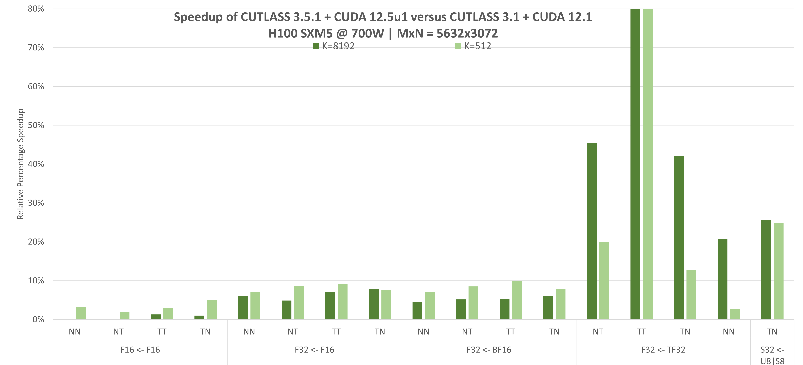

## 第 10 章:调参世界观 + `cutlass_profiler`

这一章不讲新机制——只是把 Ch1-9 给的所有"开关"整理成一张调参表,以及"怎么科学地 autotune"。

### 10.1 调参组合空间一览

`examples/48` 默认配置已经接近峰值性能。但不同 (M, N, K) shape + 不同硬件 + 不同内存层级下,还是要调。

可调的"维度"在 5 个层级上:

|调参维度|在哪|给用户切换的接口|
|---|---|---|
|**tile size**(M×N×K)|Ch2.2|`TileShape<>...>`, 一般 128/128/32 或 128/256/64|
|**cluster size**|Ch2.2|`ClusterShape<>...>`, 一般 4×2×1 / 4×4×1 / 8×8×1|
|**stage 数**|Ch2.3|`StageCount<N>` 强制;Auto 默认从 smem 推|
|**schedule 变体**|Ch7|`KernelTmaWarpSpecialized` 默认; Pingpong / Cooperative 更大 tile|
|**scheduler**|Ch6.7|`PersistentScheduler` 默认; `StreamKScheduler` 用于 K-bound|
|**raster / swizzle**|Ch2.4|`arguments.scheduler.raster_order` / `max_swizzle_size`|

> **你手写 GEMM 的对照**:这些就是你 grid_dim / block_dim / smem 切分 / cluster_dim / pipeline depth / swizzle 选型的全部决定项——CUTLASS 只是把它们"显式化"了。

### 10.2 (M, N, K) shape 决定的"匹配模式"

经验法则(可直接套):

|Shape 类型|推荐 tile|推荐 cluster|推荐 schedule|
|---|---|---|---|
|大 M、N(≥ 8192 双向 square)|`<_256,_128,_64>`|`<_2,_1,_1>` 或 `<_1,_1,_1>`|`Cooperative` (大 tile) 或 default|
|小 M(≤ 1024) + 大 N(≥ 8192)|`<_128,_256,_64>`|`<_1,_2,_1>` 或 `<_1,_1,_1>`|default 或 `Pingpong`|
|大 M、小 N 镜像|`<_256,_128,_64>`|`<_2,_1,_1>`|default|
|严格 square 中等|`<_128,_128,_32>`|`<_2,_2,_1>` 或 `<_4,_2,_1>`|default(单 warp group)|
|K-bound (K 小,M、N 大)|`<_256,_128,_32>` 或更大 K-tile|`<_1,_1,_1>`|default|
|K-bound (K 大, M、N 小)|`<_128,_128,_128>`|`<_1,_1,_1>`|`StreamKScheduler` 启用(并行化 K 维)|
|低 occupancy GPU (smem 受限)|`<_64,_64,_32>`|`<_1,_1,_1>`|smaller tile, max stages 减少|
|NVFP4 / FP8 + block scale|fp8 collector with `StageCountAuto`(stage 不变,加 block scale smem)|...|...|

> 这张表来自 `media/docs/cpp/gemm_api_3x.md` + CUTLASS profiling 多年的结果,但**实际**还要用 `cutlass_profiler` 跑一遍才知(下面)。

### 10.3 Swizzle / raster / L2 cache

CTAs 顺序与 L2 命中:

- `RasterOrderOptions::AlongN` = N direction first。**L-shape (M << N) GEMM** 时,L2 命中率更高(横向扫的 output tile 被同 L2 set 命中)。
- `RasterOrderOptions::AlongM` = M direction first。**L-shape (N << M)** 同理。
- `RasterOrderOptions::Heuristic` = 由 problem shape 自动选。
- `max_swizzle_size = 8` = 8×8 swizzle,适合"很多小 tile"。= 1 = 无 swizzle,适合超大 tile。
- `max_swizzle_size = 4` 是普适默认。

为什么 swizzle 有用:CTAs 的 tile id 不再按行/列顺序访问,而是按 swizzle 间隔访问——访问次序被打散,L2 缓存被"沿 tile 群循环用"而不是一次性被前面的 CTA 用完。

### 10.4 TMA multicast

`ClusterShape` 大了之后,sm_90 的 TMA 支持 multicast:一个 TMA load 让多个 CTA 都各拿到相同的 smem 数据,节省 gmem 带宽。**条件**:load 的 src 形状与 cluster 大小对齐。

具体看 `media/docs/cpp/dependent_kernel_launch.md` + `examples/63_hopper_gemm_with_weight_prefetch/` 的 pre-fetch + multi-cast pattern。

### 10.5 `cute::print_tensor` / `print_smem_layout` 调试

```cpp
// 调试某个 layout 的索引模式:
cute::print(smem_layout_A);              // 输出 (M, K, Stages) + stride
cute::print_latex(smem_layout_A);        // 输出 LaTeX (可视化)

// 调试某个 tensor:
cute::print_tensor(A_gmem_tensor);       // 实际打印前 1024 个元素
cute::print_tensor(A_smem_register_tile); // 同样的 register tile,按 mma view 解读
```

> 这些 hook 非常有用——尤其当你的 swizzle 后发现有些 lane 拿到错误数据时,print 一下能清晰看到"lattice"在每 lane 上的分布。

### 10.6 `cutlass_profiler` 一段最小使用

文件:`tools/profiler/src/main.cpp`。`cutlass_profiler` 是 CUTLASS 自带的 autotuner(已编译好的二进制)。

```bash
# 编译
mkdir build && cd build
cmake -DCUTLASS_NVCC_ARCHS=90a ..   # 或 100 等
make -j cutlass_profiler
# 跑一个 grid 扫描
./tools/profiler/src/cutlass_profiler \
  --operation=gemm \
  --tile=128x128_32x32 \
  --stage=4 \
  --cluster=2x2x1 \
  --iterations=10 \
  --warmup=2 \
  --problem-shape=4096x4096x4096 \
  --element=f16,f16,f16 \
  --output=csv
```

常用 flag(完整列表 `media/docs/cpp/profiler.md`):

- `--operation=gemm` / `gemm_array` / `gemm_grouped`
- `--tile=<MxN>KxK` 切换 tile
- `--stage=<N>` 强制 stage 数
- `--cluster=<MxNxK>` cluster 形状
- `--raster=<Heuristic|AlongM|AlongN>`
- `--swizzle=<1|2|4|8>` swizzle 深度
- `--iterations=<N>` 测量 N 次取平均
- `--warmup=<N>` 前 N 次不计入

输出末尾会有 GFLOPS / TFlops 数字。**profile 之前要先暖机**——`--warmup=10` 让 GPU 时钟稳定。

### 10.7 经验法则

- **经验式 1**:从 default 跑一遍 `cutlass_profiler`,得 baseline FLOPS。
- **经验式 2**:换 tile size,跑一遍;每个 tile 都"顺着 shape 推 stage 数 + 集群大小"。
- **经验式 3**:`Cooperative` schedule 在 M/N ≥ 8192 时往往最强。
- **经验式 4**:`Pingpong` 在 tile 中等(128×128) 时比 `default` 略快,在大 tile(256×256) 时反而损失。
- **经验式 5**:`StageCountAutoCarveout` 永远是对的起点,先别手动。
- **经验式 6**:`StreamK` 仅在 K-bound shape 上跑赢 persistent。
- **经验式 7**:`max_swizzle_size` 在 Hopper 上是 8 时最普适。
- **经验式 8**:alignment 128-bit 是 TMA baseline,8-byte alignment(64-bit)不够。

### 10.8 图配



(以较新一张 3.x 数据图作为参考——你看到的可能是 FP8 / FP16 不同图。)

### 10.9 章末:读完这一章你该做得到的事

- ✅ 用 `cutlass_profiler --operation=gemm --tile=128x128_32x32 --stage=4 ...` 跑一次 baseline。
- ✅ 在不同的 (M, N, K) shape 上用表格 10.2 推荐一组 tile+cluster,各自 profiler 一遍。
- ✅ 在 Ch9 的 `ExampleRunner<>` 里调 4 个 `*Type` 参数,配合 `cutlass_profiler` 评测。
- ✅ 懂得 `cutlass_profiler` 输出的几个数字怎么解读(GFLOPS、有效率、瓶颈分析)。

---

